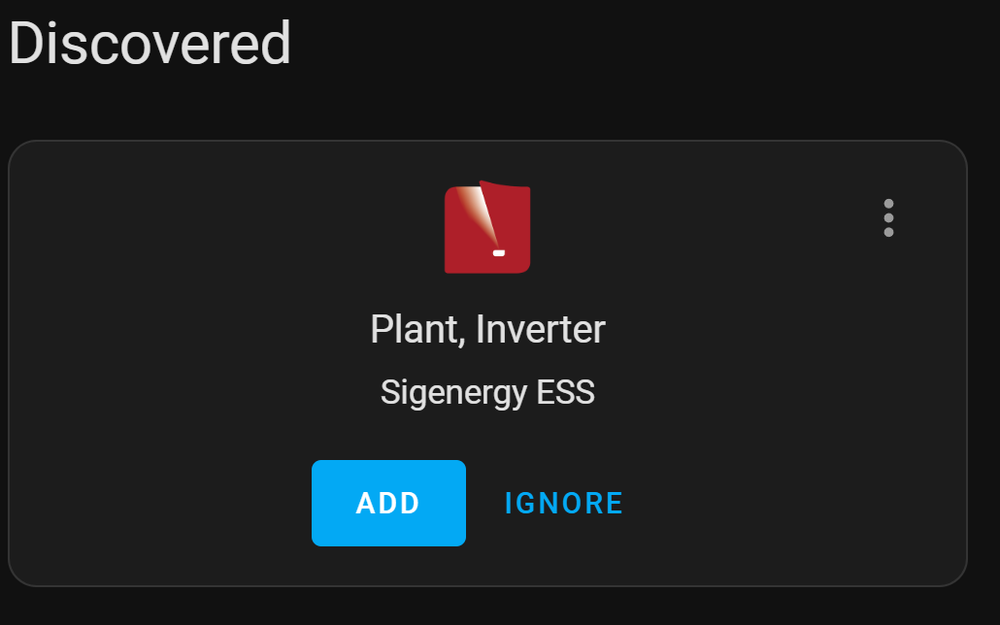

#   Sigenergy ESS Integration for Home Assistant
[](https://hacs.xyz/) [](https://github.com/TypQxQ/Sigenergy-Local-Modbus/releases) [](LICENSE)

## Overview
The Sigenergy ESS Integration brings local Modbus‑TCP monitoring and control of your Sigenergy Energy Storage System (ESS) directly into Home Assistant. Gain real‑time insights, dynamic device management, and seamless UI‑based setup.

## Features
- **UI‑Driven Setup** with DHCP discovery  
- **Dynamic Device Management** (Plants, Inverters, AC/DC Chargers)  
- **Auto‑Detect** supported registers via Modbus probing  
- **Real‑Time Metrics** for power flows, energy statistics, SoC/SoH  
- **Control Capabilities** for EMS work modes and more

## Requirements
- Home Assistant **2024.4.1** or newer  
- Home Assistant Community Store (HACS)  
- Sigenergy ESS with Modbus‑TCP enabled by your installer. And prefferably confirmed with a screenshot of your DeviceID 
- Assign a **static IP** to your Sigenergy device in your router to ensure it always receives the same IP address.

## Installation
### HACS (Recommended)
1. Go to **HACS > Integrations** in Home Assistant  
2. Click the three dots and select **Custom repositories**  
3. Add repository `TypQxQ/Sigenergy-Local-Modbus` as **Integration**  
4. Install **Sigenergy ESS Integration**  
5. Restart Home Assistant

### Manual
1. Download the latest `.zip` from the [Releases](https://github.com/TypQxQ/Sigenergy-Local-Modbus/releases) page  
2. Extract and copy `custom_components/sigen` into your HA `custom_components/` folder  
3. Restart Home Assistant

## Configuration & Usage
### Plant Concept
Central **Plant** entry groups devices by Host/IP and Port.  
```
Plant (IP:Port)
   ├─ Inverter 1 (ID 1)
   │    └─ DC Charger (via Inverter 1)
   ├─ Inverter 2 (ID 2)
   └─ AC Charger (ID 3)
```


### Initial Setup (Discovery)

1. Navigate to **Settings > Devices & Services**
2. If your Sigenergy device is discovered automatically on the network, it will appear under **Discovered**.  
    If not discovered, try unplugging and replugging the network cable of your Sigenergy system.  
    If discovery still fails, see the [Troubleshooting](#troubleshooting) section below.
> Controls are **read-only by default**. To enable control features, you must explicitly activate them in the integration configuration **and** allow them in Home Assistant. This precaution helps prevent unintended changes or adverse effects.


### Manual Initial Setup
1. Navigate to **Settings > Devices & Services > Add Integration**
2. Search for **Sigenergy**  
3. If discovered, click **Configure**; otherwise select manually  
4. Enter **Host IP**, **Port** (default 502), and first **Device ID**  
5. Add additional Inverters/Chargers via the same Plant entry

### Reconfiguration & Options
1.  Navigate to **Settings > Devices & Services**.
2.  Find your **Sigenergy** integration entry and click **Configure**.
3.  From the configuration menu, you can:
    *   Adjust **Plant** settings (e.g., read-only, refresh intervals).
    *   Modify settings for individual **Inverters** or **Chargers**.
> While it is technically possible to assign different IP addresses and ports to devices, it is not advised. For best results and reliable operation, all devices within a plant should use the same IP address and port.

### Add Additional Devices

1. Navigate to **Settings > Devices & Services**.  
2. Select the **Sigenergy** integration and click **Add Device**.  
3. Follow the prompts to add extra inverters, chargers, or a new plant.  

## Entities & Controls

**Plant Entities:** active/reactive power, PV power, SoC, grid flows, EMS mode  
**Inverter Entities:** MPPT metrics, battery SoC/SoH, phase data  
**AC Charger:** charging power, total energy, system state  
**Controls:** EMS work modes are exposed via `select` entities, and optional `button`/`switch` controls are available.  
> Controls are **read-only by default** unless  explicitly enabled in the integration configuration.

## Quickstart Automation Example
```yaml
alias: "Notify on Low Battery"
trigger:
  - platform: state
    entity_id: sensor.plant_battery_soc
    to: "<20"
action:
  - service: notify.mobile_app
    data:
      title: "Battery Low"
      message: "SoC dropped below 20%"
```

## Troubleshooting
- Ensure your installer tapped **SAVE** after enabling Modbus‑TCP on your device.
- Verify IP and firewall settings.
- Ensure again Modbus‑TCP is enabled on your ESS.
- Check Home Assistant logs for `sigen` errors.

## Contributing
Contributions welcome!  
1. Fork the repo and create a branch  
2. Add tests under `tests/components/sigen/`  
3. Follow Home Assistant coding and config‑flow patterns  
4. Submit a Pull Request

## Support & Links
- Issues: https://github.com/TypQxQ/Sigenergy-Local-Modbus/issues  
- Discussions: https://github.com/TypQxQ/Sigenergy-Local-Modbus/discussions  
- HACS docs: https://hacs.xyz/

## License
MIT License © [Andrei Ignat]