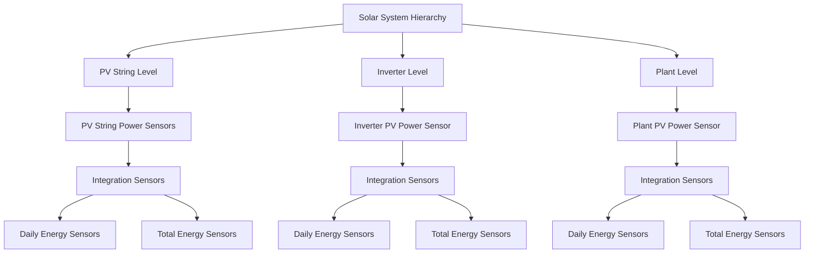

# Implementation Plan: Accumulated PV Energy Production Sensors

This document outlines the implementation plan for adding accumulated PV energy production sensors at each level of the solar system hierarchy in the Sigenergy ESS integration.

## Requirements

1. Create accumulated energy sensors for:
   - Each PV String: Energy accumulated from string's power output
   - Each Inverter: Energy accumulated from Inverter PV Power
   - The entire Plant: Energy accumulated from Plant PV Power

2. For each level, create two types of sensors:
   - Daily energy sensors: Reset at midnight
   - Total energy sensors: Never reset (total increasing)

3. Ensure sensors:
   - Track energy production in kWh
   - Persist across Home Assistant restarts
   - Are available for energy monitoring dashboards

## Technical Approach

We'll use Home Assistant's built-in `IntegrationSensor` component to calculate energy by integrating power values over time. This approach leverages existing, well-tested code and ensures proper integration with Home Assistant's energy dashboard.



## Implementation Steps

### 1. Add Integration Component Dependency

Add the integration component as a dependency in the `manifest.json` file:

```diff
{
  "domain": "sigen",
  "name": "Sigenergy ESS",
  "documentation": "https://github.com/custom-components/sigen",
  "issue_tracker": "https://github.com/custom-components/sigen/issues",
-  "dependencies": ["modbus"],
+  "dependencies": ["modbus", "integration"],
  "codeowners": ["@TypQxQ"],
  "requirements": ["pymodbus>=3.0.0"],
  "iot_class": "local_polling",
  "version": "0.1.0",
  "config_flow": true,
  "integration_type": "device",
  "quality_scale": "custom",
  "loggers": ["custom_components.sigen"]
}
```

### 2. Extend sensor.py to Add Energy Sensors

Modify the existing `async_setup_entry` function in `sensor.py` to create energy sensors:

1. Add necessary imports:
   ```python
   from homeassistant.components.integration.sensor import IntegrationSensor
   from datetime import datetime, timedelta
   import homeassistant.util.dt as dt_util
   ```

2. Create a custom `SigenergyIntegrationSensor` class:
   ```python
   class SigenergyIntegrationSensor(IntegrationSensor):
       """Representation of a Sigenergy integration sensor."""

       def __init__(
           self,
           hass: HomeAssistant,
           source_entity_id: str,
           name: str,
           unique_id: str,
           round_digits: int,
           device_info: DeviceInfo,
           reset_at_midnight: bool,
       ) -> None:
           """Initialize the integration sensor."""
           super().__init__(
               source_entity=source_entity_id,
               name=name,
               round_digits=round_digits,
               unit_prefix=None,
               unit_time=None,
               integration_method="trapezoidal",
           )
           
           self.hass = hass
           self._attr_unique_id = unique_id
           self._attr_device_class = SensorDeviceClass.ENERGY
           self._attr_state_class = SensorStateClass.TOTAL_INCREASING
           self._attr_native_unit_of_measurement = UnitOfEnergy.KILO_WATT_HOUR
           self._attr_device_info = device_info
           self._reset_at_midnight = reset_at_midnight
           
           # Set up reset at midnight if needed
           if self._reset_at_midnight:
               self._setup_reset_at_midnight()
       
       def _setup_reset_at_midnight(self) -> None:
           """Set up automatic reset at midnight."""
           now = dt_util.now()
           midnight = dt_util.start_of_local_day(now + timedelta(days=1))
           
           async def reset_at_midnight(_):
               """Reset the integration at midnight."""
               await self.async_reset_integration()
               
               # Schedule the next reset
               self._setup_reset_at_midnight()
           
           # Schedule the reset
           self.hass.helpers.event.async_track_point_in_time(
               reset_at_midnight, midnight
           )
   ```

3. Add code to create energy sensors for each level:
   - Plant level
   - Inverter level
   - PV String level

### 3. Testing and Validation

To ensure the implementation works correctly, test:

1. **Sensor Creation**: Verify all sensors are created at each level
2. **Energy Calculation**: Confirm energy values increase as expected
3. **Daily Reset**: Check that daily sensors reset at midnight
4. **Persistence**: Verify values are retained across Home Assistant restarts
5. **Energy Dashboard**: Test integration with Home Assistant's energy dashboard

## Expected Results

After implementation, users will have:

1. **PV String Energy Sensors**:
   - Daily energy production for each PV string
   - Total accumulated energy production for each PV string

2. **Inverter Energy Sensors**:
   - Daily energy production for each inverter
   - Total accumulated energy production for each inverter

3. **Plant Energy Sensors**:
   - Daily energy production for the entire plant
   - Total accumulated energy production for the entire plant

These sensors will provide valuable insights into energy production at different levels of the solar system hierarchy, enabling better monitoring and analysis of system performance.