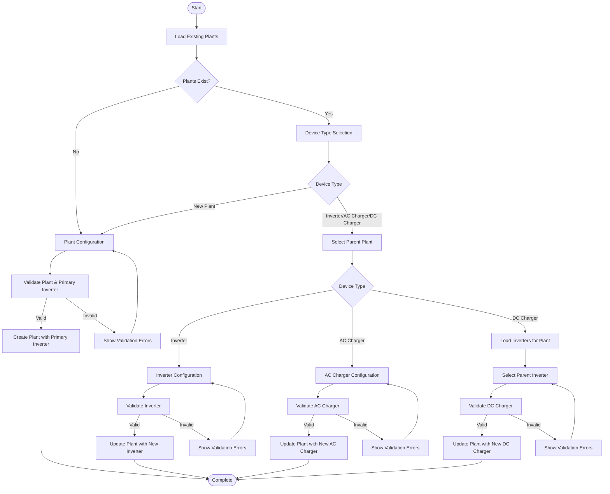

# Sigenergy Device Addition Flow

This document outlines the detailed process of how devices are added in the Sigenergy ESS integration based on the `old_config_flow.py` implementation.

## Overview

The Sigenergy integration supports adding the following device types:
1. Plants (with an implicit first inverter)
2. Additional Inverters
3. AC Chargers
4. DC Chargers

The devices follow a hierarchical structure:
- Plants are the top-level devices
- Inverters and AC Chargers are connected to Plants
- DC Chargers are connected to Inverters

## Device Addition Flow

## Detailed Process

### 1. Initial Entry Point

The flow begins at `async_step_user`, which:
1. Loads existing plants using `_async_load_plants`
2. If no plants exist, sets device type to `DEVICE_TYPE_NEW_PLANT` and proceeds to plant configuration
3. If plants exist, proceeds to device type selection

### 2. Device Type Selection

The `async_step_device_type` method:
1. Presents a form with device type options: New Plant, Inverter, AC Charger, DC Charger
2. Based on selection, routes to appropriate configuration step
3. For non-plant devices, proceeds to plant selection

### 3. Plant Configuration

The `async_step_plant_config` method:
1. Presents a form with fields:
   - Host (required)
   - Port (default: 502)
   - Inverter Slave ID (default: 1)
   - Read-only Mode (default: True)
2. Validates inputs:
   - Checks that Inverter Slave ID is between 1-246
   - Checks for duplicate Inverter Slave IDs
3. If validation passes:
   - Sets Plant ID to 247 (default)
   - Stores the Inverter Slave ID in a list
   - Initializes empty lists for AC and DC chargers
   - Generates a plant name based on number of existing plants
   - Sets device type to `DEVICE_TYPE_PLANT`
   - Creates the configuration entry

**Key Point**: The first inverter is implicitly created when adding a plant. It shares the plant's host and port, with only the Slave ID being configurable.

### 4. Plant Selection

The `async_step_select_plant` method:
1. Presents a form with a dropdown of existing plants
2. Stores the selected plant ID
3. Copies host and port from the selected plant to use as defaults
4. Routes to device-specific configuration based on device type

### 5. Inverter Configuration

The `async_step_inverter_config` method:
1. Presents a form with fields:
   - Host (default: plant's host)
   - Port (default: plant's port)
   - Slave ID (default: 1)
2. Validates inputs:
   - Checks that Slave ID is between 1-246
   - Checks for duplicate Slave IDs within the plant
3. If validation passes:
   - Generates an inverter name based on number of existing inverters
   - Creates or updates the inverter connections dictionary
   - Updates the plant's configuration with the new inverter
   - Adds the new Slave ID to the plant's inverter Slave IDs list

### 6. AC Charger Configuration

The `async_step_ac_charger_config` method:
1. Presents a form with fields:
   - Host (required)
   - Port (default: 502)
   - Slave ID (required)
2. Validates inputs:
   - Checks that Slave ID is between 1-246
   - Checks for duplicate Slave IDs within AC chargers
   - Checks for conflicts with inverter Slave IDs
3. If validation passes:
   - Generates an AC charger name based on number of existing AC chargers
   - Creates or updates the AC charger connections dictionary
   - Updates the plant's configuration with the new AC charger
   - Adds the new Slave ID to the plant's AC charger Slave IDs list

### 7. DC Charger Configuration

For DC chargers, the flow is different:
1. First loads inverters for the selected plant using `_async_load_inverters`
2. The `async_step_select_inverter` method:
   - Presents a form with a dropdown of existing inverters
   - Validates that the selected inverter exists and has a valid Slave ID
   - Checks for duplicate DC charger with this ID
   - Updates the plant's configuration with the new DC charger
   - Adds the inverter's Slave ID to the plant's DC charger Slave IDs list

**Key Point**: DC chargers reuse the Slave ID of their parent inverter. They don't have separate host/port configuration.

## Data Structure

### Plant Configuration Entry

A plant configuration entry contains:
- `CONF_DEVICE_TYPE`: "plant"
- `CONF_HOST`: Host address
- `CONF_PORT`: Port number
- `CONF_PLANT_ID`: 247 (default)
- `CONF_NAME`: Generated plant name
- `CONF_INVERTER_SLAVE_ID`: List of inverter Slave IDs
- `CONF_AC_CHARGER_SLAVE_ID`: List of AC charger Slave IDs
- `CONF_DC_CHARGER_SLAVE_ID`: List of DC charger Slave IDs
- `CONF_INVERTER_CONNECTIONS`: Dictionary mapping inverter names to connection details
- `CONF_AC_CHARGER_CONNECTIONS`: Dictionary mapping AC charger names to connection details
- `CONF_READ_ONLY`: Boolean indicating read-only mode

### Inverter Connection Details

Each inverter connection contains:
- `CONF_HOST`: Host address
- `CONF_PORT`: Port number
- `CONF_SLAVE_ID`: Slave ID

### AC Charger Connection Details

Each AC charger connection contains:
- `CONF_HOST`: Host address
- `CONF_PORT`: Port number
- `CONF_SLAVE_ID`: Slave ID

## Validation Logic

### Slave ID Validation

Slave IDs must:
1. Be integers between 1 and 246
2. Not duplicate existing IDs of the same device type
3. For AC chargers, not conflict with inverter IDs

### Host/Port Validation

The implementation doesn't explicitly validate host/port values, but they are required fields.

## Helper Methods

### `_async_load_plants`

This method:
1. Clears the `_plants` dictionary
2. Iterates through all config entries for the domain
3. Adds entries with device type "plant" to the `_plants` dictionary
4. Uses the plant name as the display value

### `_async_load_inverters`

This method:
1. Clears the `_inverters` dictionary
2. Iterates through all config entries for the domain
3. Adds entries with device type "inverter" and matching parent plant ID to the `_inverters` dictionary
4. Uses the inverter name as the display value

## Special Considerations

1. **First Inverter**: The first inverter is implicitly created when adding a plant. It shares the plant's host and port.

2. **DC Chargers**: DC chargers don't have their own Slave ID; they reuse the Slave ID of their parent inverter.

3. **Naming Convention**: Device names are generated based on the number of existing devices of that type.

4. **Hierarchical Structure**: The implementation enforces a hierarchical structure where:
   - Plants are the top-level devices
   - Inverters and AC Chargers are connected to Plants
   - DC Chargers are connected to Inverters