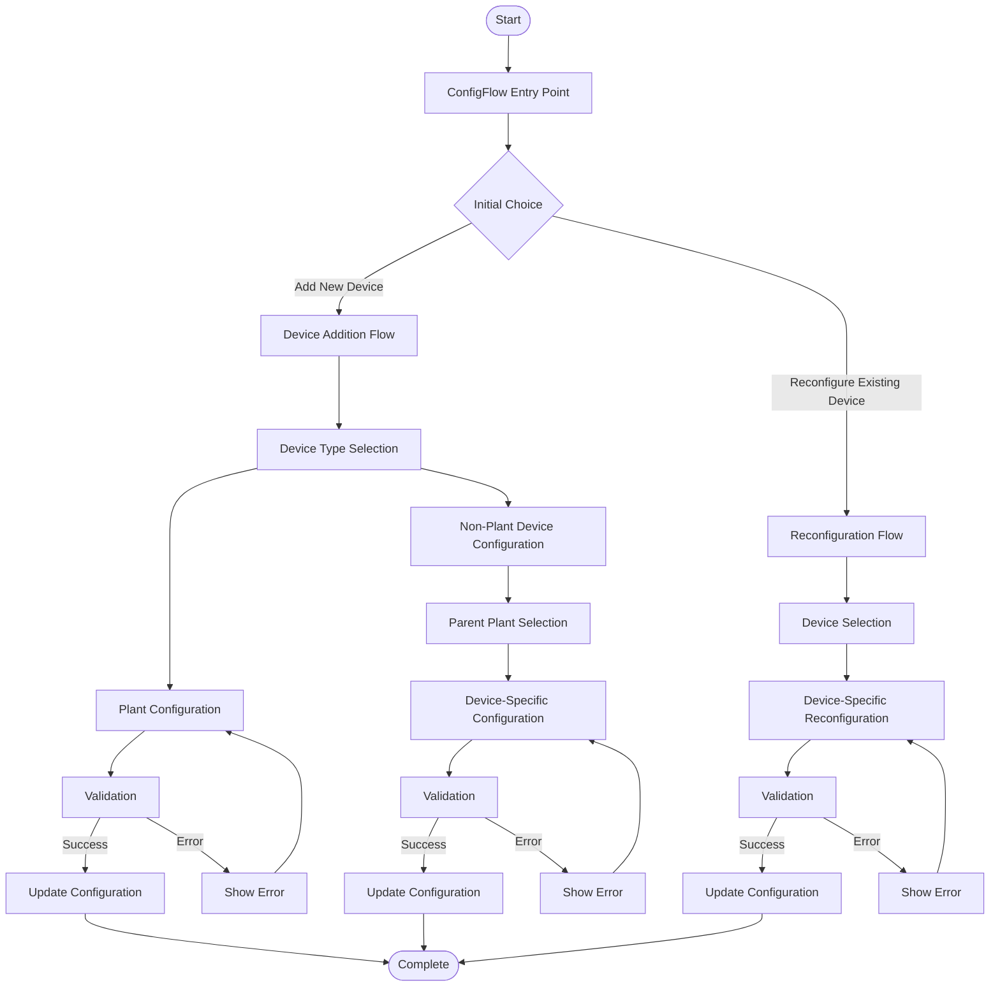

# Comprehensive Configuration Flow Implementation Plan for Home Assistant Integration

This document outlines a unified implementation plan that integrates the device addition flow with the reconfiguration flow for the Sigenergy ESS integration, following Home Assistant's configuration flow patterns and conventions.

## System Overview



## Home Assistant Configuration Flow Structure

Following Home Assistant's configuration flow patterns, we'll implement:

1. `SigenergyConfigFlow` class that extends `config_entries.ConfigFlow` for adding devices
2. `SigenergyOptionsFlowHandler` class that extends `config_entries.OptionsFlow` for reconfiguring devices
3. Translation strings in `strings.json` for UI text and error messages
4. Step-specific schemas for form validation

## Constants and Translation Keys

First, we'll define constants and translation keys in `const.py`:

```python
# Device types
DEVICE_TYPE_NEW_PLANT = "new_plant"
DEVICE_TYPE_PLANT = "plant"
DEVICE_TYPE_INVERTER = "inverter"
DEVICE_TYPE_AC_CHARGER = "ac_charger"
DEVICE_TYPE_DC_CHARGER = "dc_charger"

# Configuration steps
STEP_USER = "user"
STEP_DEVICE_TYPE = "device_type"
STEP_PLANT_CONFIG = "plant_config"
STEP_INVERTER_CONFIG = "inverter_config"
STEP_AC_CHARGER_CONFIG = "ac_charger_config"
STEP_DC_CHARGER_CONFIG = "dc_charger_config"
STEP_SELECT_PLANT = "select_plant"
STEP_SELECT_INVERTER = "select_inverter"
STEP_SELECT_DEVICE = "select_device"

# Configuration keys
CONF_DEVICE_TYPE = "device_type"
CONF_PLANT_ID = "plant_id"
CONF_SLAVE_ID = "slave_id"
CONF_INVERTER_SLAVE_ID = "inverter_slave_ids"
CONF_AC_CHARGER_SLAVE_ID = "ac_charger_slave_ids"
CONF_DC_CHARGER_SLAVE_ID = "dc_charger_slave_ids"
CONF_INVERTER_CONNECTIONS = "inverter_connections"
CONF_AC_CHARGER_CONNECTIONS = "ac_charger_connections"
CONF_PARENT_PLANT_ID = "parent_plant_id"
CONF_PARENT_INVERTER_ID = "parent_inverter_id"
CONF_SELECTED_DEVICE = "selected_device"
CONF_REMOVE_DEVICE = "remove_device"

# Default values
DEFAULT_PORT = 502
DEFAULT_PLANT_SLAVE_ID = 247
DEFAULT_INVERTER_SLAVE_ID = 1
DEFAULT_READ_ONLY = True
```

## Translation Strings

We'll define translation strings in `strings.json` following Home Assistant's conventions:

```json
{
  "config": {
    "step": {
      "user": {
        "title": "Sigenergy ESS",
        "description": "Set up Sigenergy ESS integration"
      },
      "device_type": {
        "title": "Device Type",
        "description": "Select the type of device to add",
        "data": {
          "device_type": "Device Type"
        }
      },
      "plant_config": {
        "title": "Plant Configuration",
        "description": "Configure the Sigenergy Plant",
        "data": {
          "host": "Host",
          "port": "Port",
          "inverter_slave_ids": "Inverter Slave ID",
          "read_only": "Read-only Mode"
        }
      },
      "select_plant": {
        "title": "Select Plant",
        "description": "Select the parent plant for this device",
        "data": {
          "parent_plant_id": "Parent Plant"
        }
      },
      "inverter_config": {
        "title": "Inverter Configuration",
        "description": "Configure the Sigenergy Inverter",
        "data": {
          "host": "Host",
          "port": "Port",
          "slave_id": "Slave ID"
        }
      },
      "ac_charger_config": {
        "title": "AC Charger Configuration",
        "description": "Configure the Sigenergy AC Charger",
        "data": {
          "host": "Host",
          "port": "Port",
          "slave_id": "Slave ID"
        }
      },
      "select_inverter": {
        "title": "Select Inverter",
        "description": "Select the parent inverter for this DC Charger",
        "data": {
          "parent_inverter_id": "Parent Inverter"
        }
      }
    },
    "error": {
      "invalid_host": "Invalid host address",
      "invalid_port": "Port must be between 1 and 65535",
      "invalid_integer_value": "Please enter a valid integer",
      "each_id_must_be_between_1_and_246": "Slave ID must be between 1 and 246",
      "duplicate_ids_found": "This Slave ID is already in use",
      "ac_charger_conflicts_inverter": "AC Charger Slave ID conflicts with an existing Inverter",
      "no_plants_available": "No plants available. Please add a plant first.",
      "no_inverters_available": "No inverters available. Please add an inverter first.",
      "parent_plant_not_found": "Parent plant not found",
      "parent_inverter_not_found": "Parent inverter not found",
      "parent_inverter_invalid": "Invalid parent inverter",
      "cannot_remove_parent": "Cannot remove this device while it has dependent devices"
    },
    "abort": {
      "device_added": "Device successfully added",
      "unknown_device_type": "Unknown device type"
    }
  },
  "options": {
    "step": {
      "init": {
        "title": "Device Options",
        "description": "Configure device options"
      },
      "select_device": {
        "title": "Select Device",
        "description": "Select a device to configure",
        "data": {
          "selected_device": "Device"
        }
      },
      "plant_config": {
        "title": "Plant Configuration",
        "description": "Configure the Sigenergy Plant",
        "data": {
          "host": "Host",
          "port": "Port",
          "read_only": "Read-only Mode"
        }
      },
      "inverter_config": {
        "title": "Inverter Configuration",
        "description": "Configure the Sigenergy Inverter",
        "data": {
          "host": "Host",
          "port": "Port",
          "slave_id": "Slave ID",
          "remove_device": "Remove this device"
        }
      },
      "ac_charger_config": {
        "title": "AC Charger Configuration",
        "description": "Configure the Sigenergy AC Charger",
        "data": {
          "host": "Host",
          "port": "Port",
          "slave_id": "Slave ID",
          "remove_device": "Remove this device"
        }
      },
      "dc_charger_config": {
        "title": "DC Charger Configuration",
        "description": "Configure the Sigenergy DC Charger",
        "data": {
          "parent_inverter_id": "Parent Inverter",
          "remove_device": "Remove this device"
        }
      }
    },
    "error": {
      "invalid_host": "Invalid host address",
      "invalid_port": "Port must be between 1 and 65535",
      "invalid_integer_value": "Please enter a valid integer",
      "each_id_must_be_between_1_and_246": "Slave ID must be between 1 and 246",
      "duplicate_ids_found": "This Slave ID is already in use",
      "ac_charger_conflicts_inverter": "AC Charger Slave ID conflicts with an existing Inverter",
      "cannot_remove_parent": "Cannot remove this device while it has dependent devices"
    }
  }
}
```

## Enhanced Validation Module

We'll create a comprehensive validation module that follows Home Assistant's patterns:

```python
"""Validation utilities for Sigenergy ESS integration."""
from typing import Dict, List, Optional, Tuple, Any

from homeassistant.core import HomeAssistant
from homeassistant.config_entries import ConfigEntry

from .const import (
    CONF_SLAVE_ID,
    CONF_INVERTER_SLAVE_ID,
    CONF_AC_CHARGER_SLAVE_ID,
    CONF_DC_CHARGER_SLAVE_ID,
    CONF_DEVICE_TYPE,
    DEVICE_TYPE_INVERTER,
    DEVICE_TYPE_AC_CHARGER,
    DEVICE_TYPE_DC_CHARGER,
    DOMAIN,
)


def validate_slave_id(
    slave_id: int, 
    existing_ids: Optional[List[int]] = None
) -> Dict[str, str]:
    """Validate a slave ID.
    
    Args:
        slave_id: The slave ID to validate
        existing_ids: Optional list of existing slave IDs to check for duplicates
        
    Returns:
        Dictionary of errors, empty if validation passes
    """
    errors = {}
    
    # Check range
    if slave_id is None or not (1 <= slave_id <= 246):
        errors["slave_id"] = "each_id_must_be_between_1_and_246"
        return errors
        
    # Check for duplicates
    if existing_ids and slave_id in existing_ids:
        errors["slave_id"] = "duplicate_ids_found"
        
    return errors


def validate_host_port(host: str, port: int) -> Dict[str, str]:
    """Validate host and port combination.
    
    Args:
        host: The host address
        port: The port number
        
    Returns:
        Dictionary of errors, empty if validation passes
    """
    errors = {}
    
    if not host:
        errors["host"] = "invalid_host"
    
    if not port or not (1 <= port <= 65535):
        errors["port"] = "invalid_port"
        
    return errors


def validate_inverter_as_parent(
    hass: HomeAssistant,
    inverter_entry_id: str
) -> Tuple[Dict[str, str], Optional[ConfigEntry]]:
    """Validate that an inverter can be a parent.
    
    Args:
        hass: The Home Assistant instance
        inverter_entry_id: The entry ID of the inverter
        
    Returns:
        Tuple of (errors, inverter_entry)
    """
    errors = {}
    
    inverter_entry = hass.config_entries.async_get_entry(inverter_entry_id)
    if not inverter_entry:
        errors["parent_inverter_id"] = "parent_inverter_not_found"
        return errors, None
        
    if not inverter_entry.data.get(CONF_SLAVE_ID):
        errors["parent_inverter_id"] = "parent_inverter_invalid"
        
    return errors, inverter_entry


def validate_device_removal(
    hass: HomeAssistant,
    device_entry: ConfigEntry
) -> Dict[str, str]:
    """Validate that a device can be removed.
    
    Args:
        hass: The Home Assistant instance
        device_entry: The config entry of the device to remove
        
    Returns:
        Dictionary of errors, empty if validation passes
    """
    errors = {}
    device_type = device_entry.data.get(CONF_DEVICE_TYPE)
    
    if device_type == DEVICE_TYPE_INVERTER:
        # Check if this inverter has DC chargers
        inverter_slave_id = device_entry.data.get(CONF_SLAVE_ID)
        
        for entry in hass.config_entries.async_entries(DOMAIN):
            if entry.data.get(CONF_DEVICE_TYPE) == DEVICE_TYPE_PLANT:
                dc_chargers = entry.data.get(CONF_DC_CHARGER_SLAVE_ID, [])
                if inverter_slave_id in dc_chargers:
                    errors["remove_device"] = "cannot_remove_parent"
                    break
    
    return errors
```

## Error Handling Strategy

Our error handling strategy follows Home Assistant's patterns:

1. **Validation Functions**: Each validation function returns a dictionary of errors, with the field name as the key and the error code as the value.

2. **Error Display**: Errors are displayed in the form using Home Assistant's built-in error handling.

3. **Translation Keys**: Error messages are defined in `strings.json` and referenced by key in the validation functions.

4. **Field-Specific Errors**: Errors are associated with specific fields when possible, allowing for targeted error messages.

5. **Form Re-display**: When validation fails, the form is re-displayed with the errors and the user's input preserved.

### Example Error Handling in Config Flow

```python
async def async_step_inverter_config(self, user_input=None):
    """Handle the inverter configuration step."""
    errors = {}
    
    if user_input is None:
        # Show form with default values
        schema = vol.Schema({
            vol.Required(CONF_HOST, default=self._data.get(CONF_HOST, "")): str,
            vol.Required(CONF_PORT, default=self._data.get(CONF_PORT, DEFAULT_PORT)): int,
            vol.Required(CONF_SLAVE_ID, default=DEFAULT_INVERTER_SLAVE_ID): int,
        })
        
        return self.async_show_form(
            step_id=STEP_INVERTER_CONFIG,
            data_schema=schema,
        )
    
    # Validate the input
    errors = validate_inverter_config(
        self.hass,
        user_input,
        self._selected_plant_entry_id
    )
    
    if errors:
        # Show form with errors and user input preserved
        schema = vol.Schema({
            vol.Required(CONF_HOST, default=user_input.get(CONF_HOST, "")): str,
            vol.Required(CONF_PORT, default=user_input.get(CONF_PORT, DEFAULT_PORT)): int,
            vol.Required(CONF_SLAVE_ID, default=user_input.get(CONF_SLAVE_ID, DEFAULT_INVERTER_SLAVE_ID)): int,
        })
        
        return self.async_show_form(
            step_id=STEP_INVERTER_CONFIG,
            data_schema=schema,
            errors=errors,
        )
    
    # Process the validated input
    slave_id = int(user_input[CONF_SLAVE_ID])
    
    # Update the plant's configuration with the new inverter
    plant_entry = self.hass.config_entries.async_get_entry(self._selected_plant_entry_id)
    if plant_entry:
        plant_inverters = plant_entry.data.get(CONF_INVERTER_SLAVE_ID, [])
        
        # Generate inverter name
        inverter_no = len(plant_inverters)
        inverter_name = f"Inverter{' ' if inverter_no == 0 else f' {inverter_no + 1} '}"
        
        # Update plant configuration
        new_data = dict(plant_entry.data)
        
        # Update inverter connections
        inverter_connections = new_data.get(CONF_INVERTER_CONNECTIONS, {})
        inverter_connections[inverter_name] = {
            CONF_HOST: user_input[CONF_HOST],
            CONF_PORT: user_input[CONF_PORT],
            CONF_SLAVE_ID: slave_id
        }
        
        # Update inverter slave IDs
        new_data[CONF_INVERTER_SLAVE_ID] = plant_inverters + [slave_id]
        new_data[CONF_INVERTER_CONNECTIONS] = inverter_connections
        
        # Update the config entry
        self.hass.config_entries.async_update_entry(
            plant_entry,
            data=new_data
        )
        
        # Abort with success message
        return self.async_abort(reason="device_added")
    
    # If we get here, something went wrong
    return self.async_abort(reason="parent_plant_not_found")
```

## Integration Points and Optimization Opportunities

### 1. Shared Validation Logic

Both flows need to validate similar inputs (slave IDs, host/port combinations). We've extracted this logic into shared validation functions to ensure consistency and reduce code duplication.

### 2. Consistent Data Structures

We use consistent data structures for device configuration across both flows. This ensures that devices added through the addition flow can be properly reconfigured through the reconfiguration flow.

### 3. Hierarchical Device Management

Both flows maintain the hierarchical relationship between devices:
- Plants are the top-level devices
- Inverters and AC Chargers are connected to Plants
- DC Chargers are connected to Inverters

### 4. Error Handling

We've implemented comprehensive error handling with clear, user-friendly error messages. This includes validation errors, network errors, and logical constraints (e.g., cannot remove an inverter that has DC chargers).

## Critical Design Decisions

### 1. Device Removal Strategy

**Decision Point**: How should device removal be handled, especially for devices with dependencies?

**Recommendation**: Implement a validation check that prevents removing devices that have dependencies, with clear error messages explaining why removal is prevented.

### 2. Configuration Update Strategy

**Decision Point**: How should configuration updates be applied?

**Recommendation**: Apply changes immediately after validation to ensure a responsive user experience, but with proper error handling to maintain data integrity.

### 3. Device Identification Strategy

**Decision Point**: How should devices be identified in the reconfiguration flow?

**Recommendation**: Use a composite identifier that combines device type and entry ID to provide robust identification while maintaining user-friendly display names.

## Implementation Phases

### Phase 1: Core Infrastructure

1. Implement shared validation module
2. Update data structures for consistency
3. Implement basic device addition flow
4. Implement basic reconfiguration flow

### Phase 2: Enhanced Functionality

1. Implement device removal functionality
2. Add support for batch updates
3. Improve error handling and user feedback
4. Add confirmation dialogs for critical actions

### Phase 3: Advanced Features

1. Implement network connectivity validation
2. Add configuration templates
3. Add import/export functionality
4. Implement advanced UI enhancements

## Conclusion

This implementation plan provides a comprehensive approach to integrating the device addition flow with the reconfiguration flow. By leveraging shared validation logic, consistent data structures, and a unified user experience, we can create a cohesive system that allows users to easily add and reconfigure devices.

The plan addresses potential conflicts and optimization opportunities, and highlights critical design decisions that require careful consideration. By implementing this plan in phases, we can ensure a smooth transition and minimize disruption to existing functionality.
