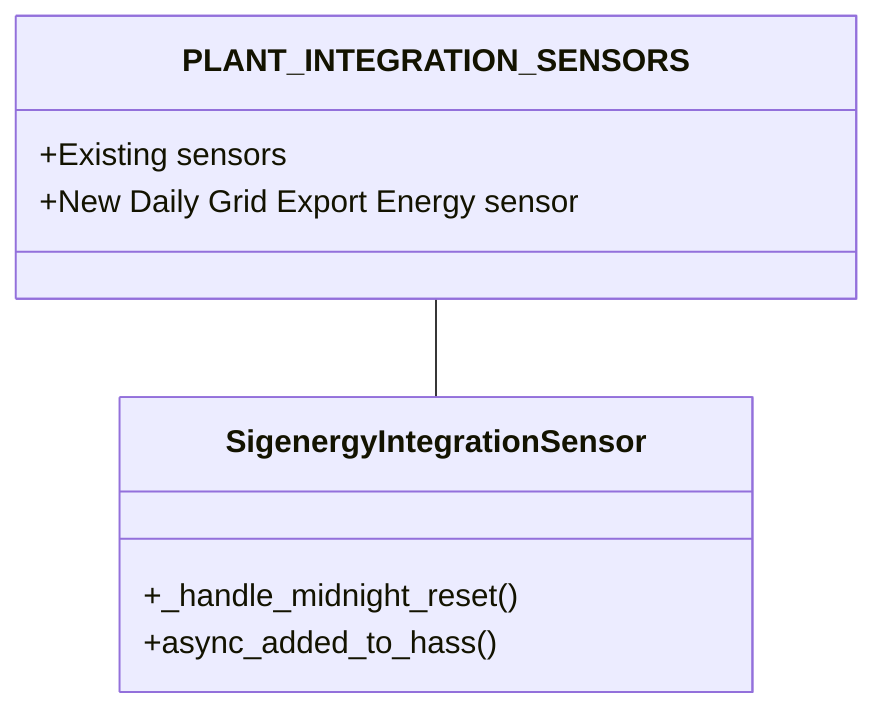
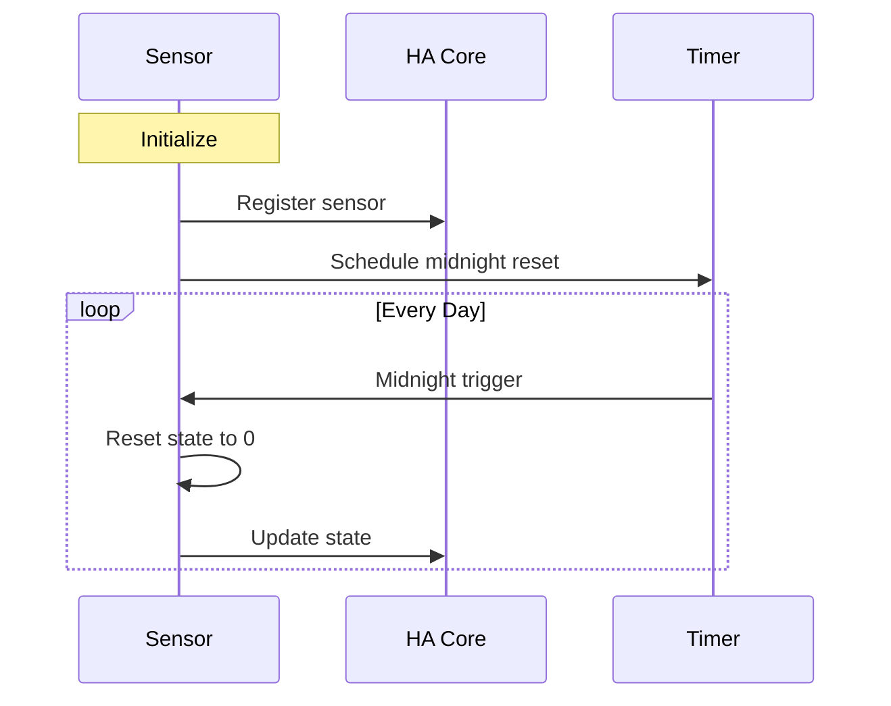

# Plan: Adding Daily Grid Export Energy Sensor

## Overview
Add a new sensor "Daily Grid Export Energy" that tracks the daily accumulated grid export energy, resetting at midnight. This sensor will be based on the existing "Accumulated Grid Export Energy" sensor.

## Technical Design

### 1. New Sensor Description
Add to `PLANT_INTEGRATION_SENSORS` list:
```python
SigenergyCalculations.SigenergySensorEntityDescription(
    key="plant_daily_grid_export_energy",
    name="Daily Grid Export Energy",
    device_class=SensorDeviceClass.ENERGY,
    native_unit_of_measurement=UnitOfEnergy.KILO_WATT_HOUR,
    state_class=SensorStateClass.TOTAL_INCREASING,
    source_key="plant_grid_export_power",  # Same source as accumulated version
    round_digits=3,
    max_sub_interval=timedelta(seconds=30),
)
```

### 2. Extend SigenergyIntegrationSensor Class
Add midnight reset functionality:
```python
class SigenergyIntegrationSensor:
    async def async_added_to_hass(self) -> None:
        await super().async_added_to_hass()
        
        # Add midnight reset for daily sensors
        if "daily" in self.entity_description.key:
            self._setup_midnight_reset()
            
    def _setup_midnight_reset(self) -> None:
        """Schedule reset at midnight."""
        now = dt_util.now()
        midnight = (now + timedelta(days=1)).replace(
            hour=0, minute=0, second=0, microsecond=0
        )
        
        async def _handle_midnight(now):
            """Handle midnight reset."""
            self._state = Decimal(0)
            self._last_valid_state = self._state
            self.async_write_ha_state()
            self._setup_midnight_reset()  # Schedule next reset
            
        # Schedule the reset
        async_track_point_in_time(
            self.hass, _handle_midnight, midnight
        )
```

### 3. Flow Diagrams



Daily Reset Flow:


## Implementation Steps

1. Add new sensor description to `PLANT_INTEGRATION_SENSORS`
2. Add midnight reset functionality to `SigenergyIntegrationSensor`
3. Test sensor creation and behavior

## Testing Plan

1. Basic Functionality
   - Verify sensor creation and registration
   - Verify energy accumulation matches grid export power

2. Reset Functionality
   - Verify midnight reset occurs
   - Verify state becomes 0 at reset
   - Verify accumulation starts again after reset

3. Edge Cases
   - Verify proper state restoration after HA restart
   - Verify behavior during DST changes
   - Verify behavior with power outages

4. Integration
   - Verify no impact on other sensors
   - Verify proper coordination with related grid sensors

## Concerns and Mitigations

1. **Time Zone Handling**
   - Use HA's native time utilities (dt_util) for consistent timezone handling
   - Consider plant's timezone setting for proper midnight determination

2. **State Restoration**
   - Properly handle state restoration after HA restarts
   - Consider adding last_reset attribute for tracking reset times

3. **Performance**
   - Reuse existing integration code paths
   - Keep memory footprint minimal

## Next Steps

1. Code Implementation
2. Testing
3. Documentation Update
4. Code Review
5. Integration Testing
6. Release