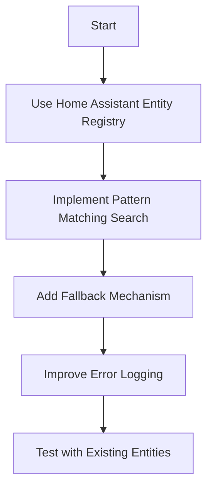

# Implementation Plan to Handle Entity ID Renaming

## Problem Analysis

The issue you're experiencing is a common one in Home Assistant: when a new entity is created with the same ID as an existing entity, Home Assistant automatically appends a number to make it unique (e.g., "sensor.sigen_plant_pv_power" becomes "sensor.sigen_plant_pv_power_2").

Our current implementation doesn't account for this scenario because:
1. We're tracking the entity IDs we expect to be created
2. We're not checking what entity IDs are actually registered in Home Assistant
3. We have no fallback mechanism when the expected entity ID doesn't match the actual one

## Proposed Solution

We need to modify our approach to handle entity ID renaming by Home Assistant. Here's a detailed plan:



### 1. Use Home Assistant's Entity Registry

Instead of tracking entity IDs ourselves, we should use Home Assistant's entity registry to look up the actual entity IDs that were registered:

```python
from homeassistant.helpers.entity_registry import async_get as async_get_entity_registry

# In async_setup_entry
entity_registry = async_get_entity_registry(hass)

# After creating a sensor
registered_entity = entity_registry.async_get_entity_id(
    "sensor", DOMAIN, unique_id
)
if registered_entity:
    # Use the registered entity ID instead of our calculated one
    actual_entity_id = registered_entity
```

### 2. Implement Pattern Matching Search

If we can't find an exact match for the entity ID, we should search for entities that match a pattern:

```python
def find_matching_entity(hass, device_type, key):
    """Find an entity that matches the given device type and key."""
    # First try the exact match
    entity_id = get_source_entity_id(device_type, None, key)
    if entity_id:
        return entity_id
        
    # If not found, search for entities that match the pattern
    pattern = f"sensor.sigen_.*{key}"
    for entity_id in hass.states.async_entity_ids("sensor"):
        if re.match(pattern, entity_id):
            _LOGGER.debug("Found matching entity %s for key %s", entity_id, key)
            return entity_id
            
    return None
```

### 3. Add Fallback Mechanism

If we still can't find a matching entity, we should provide a fallback mechanism:

```python
# In the integration sensor creation code
source_entity_id = find_matching_entity(hass, DEVICE_TYPE_PLANT, description.source_key)
if not source_entity_id:
    # Try a fallback pattern
    fallback_pattern = f"sensor.*{description.source_key}"
    for entity_id in hass.states.async_entity_ids("sensor"):
        if re.match(fallback_pattern, entity_id):
            _LOGGER.warning(
                "Using fallback entity %s for key %s",
                entity_id, description.source_key
            )
            source_entity_id = entity_id
            break
```

### 4. Improve Error Logging

Enhance the error logging to provide more context about what entities are available:

```python
if not source_entity_id:
    _LOGGER.warning(
        "Could not find source entity with key %s for device type %s, device ID %s",
        source_key, device_type, device_id
    )
    _LOGGER.debug("Available sensor entities: %s", 
                 hass.states.async_entity_ids("sensor"))
```

### 5. Add Configuration Option

As a last resort, we could add a configuration option to allow users to manually specify the source entities:

```python
# In config_flow.py
async def async_step_user(self, user_input=None):
    """Handle a flow initialized by the user."""
    # ... existing code ...
    
    # Add advanced options
    if self._step_id == "advanced":
        return self.async_show_form(
            step_id="advanced",
            data_schema=vol.Schema({
                vol.Optional("plant_pv_power_entity"): str,
                vol.Optional("plant_grid_export_power_entity"): str,
                vol.Optional("plant_grid_import_power_entity"): str,
            }),
        )
```

## Implementation Details

### 1. Modify the `get_source_entity_id` Function

```python
def get_source_entity_id(device_type, device_id, source_key):
    """Get the source entity ID for an integration sensor."""
    # First try the exact match from our registry
    device_key = (device_type, device_id)
    if device_key in entity_registry and source_key in entity_registry[device_key]:
        return entity_registry[device_key][source_key]
    
    # If not found, search for entities that match the pattern
    pattern = f".*{source_key}"
    matching_entities = []
    
    for entity_id in hass.states.async_entity_ids("sensor"):
        if source_key in entity_id and device_type.lower() in entity_id:
            matching_entities.append(entity_id)
    
    if matching_entities:
        # Use the first matching entity
        _LOGGER.debug(
            "Using matching entity %s for key %s (device type %s, device ID %s)",
            matching_entities[0], source_key, device_type, device_id
        )
        return matching_entities[0]
    
    _LOGGER.warning(
        "Could not find source entity with key %s for device type %s, device ID %s",
        source_key, device_type, device_id
    )
    _LOGGER.debug("Available sensor entities: %s", 
                 [e for e in hass.states.async_entity_ids("sensor") if "sigen" in e])
    
    return None
```

### 2. Update the Integration Sensor Creation Code

```python
# For plant integration sensors
for description in SCS.PLANT_INTEGRATION_SENSORS:
    # Look up the source entity ID based on the source key
    source_entity_id = get_source_entity_id(
        DEVICE_TYPE_PLANT,
        None,  # Plant has no device_id
        description.source_key
    )
    
    if source_entity_id:
        _LOGGER.debug("Creating plant integration sensor with source entity ID: %s", source_entity_id)
        entities.append(
            SigenergyIntegrationSensor(
                coordinator=coordinator,
                description=description,
                name=f"{plant_name} {description.name}",
                device_type=DEVICE_TYPE_PLANT,
                device_id=None,
                device_name=plant_name,
                source_entity_id=source_entity_id,
                round_digits=description.round_digits,
                max_sub_interval=description.max_sub_interval,
            )
        )
    else:
        _LOGGER.warning(
            "Skipping integration sensor %s because source entity not found. Available entities: %s",
            f"{plant_name} {description.name}",
            [e for e in hass.states.async_entity_ids("sensor") if "sigen" in e and "plant" in e]
        )
```

## Testing Plan

1. Test with a clean installation (no existing entities)
2. Test with existing entities that cause renaming
3. Test with multiple plants and inverters
4. Test the fallback mechanism by intentionally creating conflicting entity IDs

This approach should handle the entity ID renaming issue by:
1. Using Home Assistant's entity registry to get the actual entity IDs
2. Implementing pattern matching to find entities when exact matches fail
3. Adding fallback mechanisms and improved error logging
4. Providing configuration options for manual specification if needed