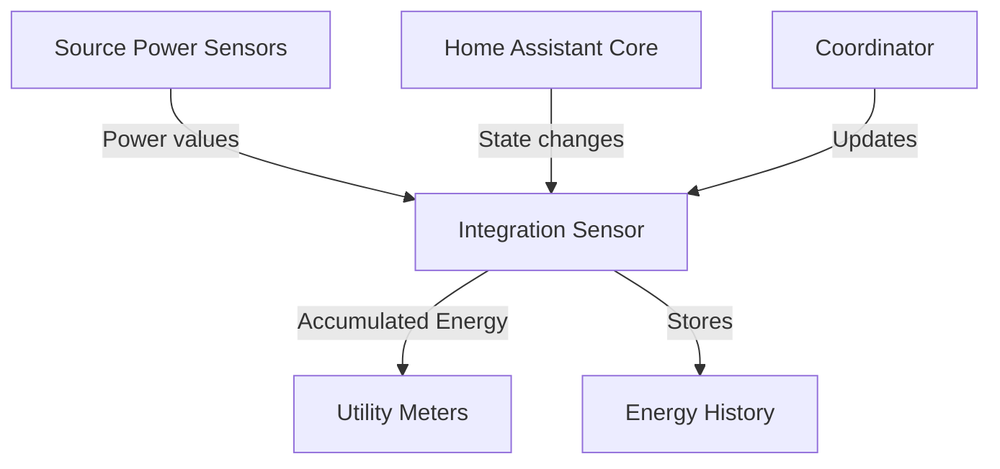

# Refined Implementation Plan for Accumulated Energy Sensors

Based on the extracted data and your feedback, this document outlines a refined plan for implementing the 'Accumulated energy' sensors in your Python-based custom component. After analyzing the Home Assistant core integration sensor implementation, we'll ensure identical mathematical integration algorithms for consistent results.

## 1. Architecture Overview



## 2. Implementation Components

### 2.1 Integration Sensor Class

We'll create a new class for integration sensors that will:
- Subscribe to state changes of the source power sensor
- Calculate accumulated energy using the trapezoidal method
- Handle state restoration on Home Assistant restart
- Implement identical mathematical algorithms as the core integration component

### 2.2 Integration Method

Implement the trapezoidal method for all sensors, using the exact same algorithm as in Home Assistant core:
- **Trapezoidal Method**: `elapsed_time * (left + right) / 2`
- Use Decimal for precise calculations to match core implementation

### 2.3 Configuration and Registration

Create separate lists of integration sensors in the calculated_sensor.py file for plant and inverter sensors, similar to how other sensor lists are defined (like SCS.INVERTER_SENSORS). These lists will then be used in the existing for loops in sensor.py to add the entities to Home Assistant.

## 3. Detailed Code Structure

### 3.1 Update `calculated_sensor.py` to add integration sensors

```python
"""Calculated sensor implementations for Sigenergy integration."""
# Existing imports...
from datetime import timedelta
from decimal import Decimal, InvalidOperation

from homeassistant.components.sensor import (
    SensorDeviceClass,
    SensorEntityDescription,
    SensorStateClass,
    RestoreSensor,
)
from homeassistant.const import (
    UnitOfEnergy,
    UnitOfPower,
    STATE_UNAVAILABLE,
)
from homeassistant.core import callback
from homeassistant.helpers.event import async_track_state_change_event
from homeassistant.util import dt as dt_util

# Existing code...

class SigenergyIntegrationSensor(RestoreSensor):
    """Implementation of an Integration Sensor."""
    
    _attr_state_class = SensorStateClass.TOTAL
    _attr_should_poll = False

    def __init__(
        self,
        coordinator: SigenergyDataUpdateCoordinator,
        description: SensorEntityDescription,
        name: str,
        device_type: str,
        device_id: Optional[int],
        device_name: Optional[str] = "",
        device_info: Optional[DeviceInfo] = None,
        source_entity_id: str = None,
        round_digits: Optional[int] = None,
        max_sub_interval: Optional[timedelta] = None,
    ) -> None:
        """Initialize the integration sensor."""
        super().__init__(coordinator)
        self.entity_description = description
        self._attr_name = name
        self._device_type = device_type
        self._device_id = device_id
        self._device_info_override = device_info
        self._source_entity_id = source_entity_id
        self._round_digits = round_digits
        self._max_sub_interval = max_sub_interval or timedelta(hours=1)
        
        self._state: Decimal | None = None
        self._last_valid_state: Decimal | None = None
        self._last_updated = None
        self._last_value = None
        
        # Set unique ID
        if device_type == DEVICE_TYPE_PLANT:
            self._attr_unique_id = f"{coordinator.hub.config_entry.entry_id}_{device_type}_{description.key}"
        else:
            device_number_str = device_name.split()[-1]
            device_number_str = f" {device_number_str}" if device_number_str.isdigit() else ""
            self._attr_unique_id = f"{coordinator.hub.config_entry.entry_id}_{device_type}_{device_number_str}_{description.key}"
        
        # Set device info (use provided device_info if available)
        if self._device_info_override:
            self._attr_device_info = self._device_info_override
        else:
            # Use the same device info logic as in SigenergySensor class
            # ...

    def _decimal_state(self, state: str) -> Decimal | None:
        """Convert state to Decimal or return None if not possible."""
        try:
            return Decimal(state)
        except (InvalidOperation, TypeError):
            return None

    def _calculate_trapezoidal(self, elapsed_time: Decimal, left: Decimal, right: Decimal) -> Decimal:
        """Calculate area using the trapezoidal method."""
        return elapsed_time * (left + right) / 2

    def _update_integral(self, area: Decimal) -> None:
        """Update the integral with the calculated area."""
        if isinstance(self._state, Decimal):
            self._state += area
        else:
            self._state = area
        self._last_valid_state = self._state

    async def async_added_to_hass(self):
        """Handle entity which will be added."""
        await super().async_added_to_hass()
        
        # Restore previous state if available
        last_state = await self.async_get_last_state()
        if last_state and last_state.state not in (None, "unknown", "unavailable"):
            try:
                self._state = Decimal(last_state.state)
                self._last_updated = dt_util.utcnow()
                self._last_valid_state = self._state
            except (ValueError, TypeError, InvalidOperation):
                _LOGGER.warning("Could not restore last state for %s", self.entity_id)
        
        # Register to track source sensor state changes
        self.async_on_remove(
            async_track_state_change_event(
                self.hass, [self._source_entity_id], self._async_source_changed
            )
        )

    @callback
    def _async_source_changed(self, event):
        """Handle source sensor state changes."""
        old_state = event.data.get("old_state")
        new_state = event.data.get("new_state")
        
        if new_state is None or new_state.state == STATE_UNAVAILABLE:
            self._attr_available = False
            self.async_write_ha_state()
            return
            
        if old_state is None or old_state.state in ("unknown", "unavailable"):
            self._attr_available = True
            self._last_updated = new_state.last_updated
            self.async_write_ha_state()
            return
            
        try:
            current_value = self._decimal_state(new_state.state)
            previous_value = self._decimal_state(old_state.state)
            
            if current_value is None or previous_value is None:
                self._attr_available = True
                self.async_write_ha_state()
                return
                
            current_time = dt_util.utcnow()
            if self._last_updated:
                time_delta = current_time - self._last_updated
                time_delta_seconds = Decimal(time_delta.total_seconds())
                
                # Handle max_sub_interval
                if self._max_sub_interval and time_delta > self._max_sub_interval:
                    # Split into smaller intervals
                    energy = self._handle_max_sub_interval(previous_value, current_value, time_delta_seconds)
                else:
                    # Calculate energy using trapezoidal method
                    energy = self._calculate_trapezoidal(time_delta_seconds, previous_value, current_value)
                
                # Update the integral
                self._update_integral(energy / 3600)  # Convert seconds to hours
                
                # Round to specified precision
                if self._round_digits is not None:
                    self._attr_native_value = round(self._state, self._round_digits)
                else:
                    self._attr_native_value = self._state
            
            self._last_updated = current_time
            self._attr_available = True
            self.async_write_ha_state()
            
        except (ValueError, TypeError, InvalidOperation) as ex:
            _LOGGER.warning("Error calculating integral for %s: %s", self.entity_id, ex)
            self.async_write_ha_state()

    def _handle_max_sub_interval(self, previous_value: Decimal, current_value: Decimal, time_delta_seconds: Decimal) -> Decimal:
        """Handle max_sub_interval by splitting calculation if needed."""
        max_sub_interval_seconds = Decimal(self._max_sub_interval.total_seconds())
        
        if time_delta_seconds <= max_sub_interval_seconds:
            # No need to split
            return self._calculate_trapezoidal(time_delta_seconds, previous_value, current_value)
        else:
            # Split into smaller intervals
            energy = Decimal(0)
            remaining_seconds = time_delta_seconds
            
            # Calculate how many complete intervals
            num_complete_intervals = int(remaining_seconds // max_sub_interval_seconds)
            
            # For each complete interval, interpolate the value and calculate
            for i in range(num_complete_intervals):
                fraction = Decimal(i + 1) / Decimal(num_complete_intervals + 1)
                interpolated_value = previous_value + (current_value - previous_value) * fraction
                energy += self._calculate_trapezoidal(max_sub_interval_seconds, 
                                                     previous_value + (current_value - previous_value) * (Decimal(i) / Decimal(num_complete_intervals + 1)),
                                                     interpolated_value)
            
            # Calculate the final partial interval
            remaining_partial = remaining_seconds - (max_sub_interval_seconds * num_complete_intervals)
            if remaining_partial > 0:
                last_interpolated = previous_value + (current_value - previous_value) * (Decimal(num_complete_intervals) / Decimal(num_complete_intervals + 1))
                energy += self._calculate_trapezoidal(remaining_partial, last_interpolated, current_value)
            
            return energy

    @property
    def native_value(self):
        """Return the state of the sensor."""
        if isinstance(self._state, Decimal) and self._round_digits is not None:
            return round(self._state, self._round_digits)
        return self._state

class SigenergyCalculatedSensors:
    """Class for holding calculated sensor methods."""

    # Existing sensor lists...
    
    # Add the plant integration sensors list
    PLANT_INTEGRATION_SENSORS = [
        SC.SigenergySensorEntityDescription(
            key="plant_accumulated_pv_energy",
            name="Accumulated PV Energy",
            device_class=SensorDeviceClass.ENERGY,
            native_unit_of_measurement=UnitOfEnergy.KILO_WATT_HOUR,
            state_class=SensorStateClass.TOTAL,
            source_entity_id="sensor.sigen_plant_photovoltaic_power",
            round_digits=3,
            max_sub_interval=timedelta(seconds=30),
        ),
        SC.SigenergySensorEntityDescription(
            key="plant_accumulated_grid_export_energy",
            name="Accumulated Grid Export Energy",
            device_class=SensorDeviceClass.ENERGY,
            native_unit_of_measurement=UnitOfEnergy.KILO_WATT_HOUR,
            state_class=SensorStateClass.TOTAL,
            source_entity_id="sensor.sigen_grid_sensor_export_power",
            round_digits=3,
            max_sub_interval=timedelta(seconds=30),
        ),
        SC.SigenergySensorEntityDescription(
            key="plant_accumulated_grid_import_energy",
            name="Accumulated Grid Import Energy",
            device_class=SensorDeviceClass.ENERGY,
            native_unit_of_measurement=UnitOfEnergy.KILO_WATT_HOUR,
            state_class=SensorStateClass.TOTAL,
            source_entity_id="sensor.sigen_grid_sensor_import_power",
            round_digits=3,
            max_sub_interval=timedelta(seconds=30),
        ),
    ]
    
    # Add the inverter integration sensors list
    INVERTER_INTEGRATION_SENSORS = [
        SC.SigenergySensorEntityDescription(
            key="inverter_accumulated_pv_energy",
            name="Accumulated PV Energy",
            device_class=SensorDeviceClass.ENERGY,
            native_unit_of_measurement=UnitOfEnergy.KILO_WATT_HOUR,
            state_class=SensorStateClass.TOTAL,
            source_entity_id="sensor.sigen_inverter_pv_power",
            round_digits=3,
            max_sub_interval=timedelta(seconds=30),
        ),
    ]
```

### 3.2 Update `sensor.py` to add integration sensors to existing loops

Modify the `async_setup_entry` function in sensor.py to add the integration sensors to the existing loops:

```python
async def async_setup_entry(
    hass: HomeAssistant,
    config_entry: ConfigEntry,
    async_add_entities: AddEntitiesCallback,
) -> None:
    """Set up the Sigenergy sensor platform."""
    coordinator = hass.data[DOMAIN][config_entry.entry_id]["coordinator"]
    entities = []

    # Add plant sensors
    for description in SS.PLANT_SENSORS + SCS.PLANT_SENSORS + SCS.PLANT_INTEGRATION_SENSORS:
        entities.append(
            SigenergySensor(
                coordinator=coordinator,
                description=description,
                name=f"{plant_name} {description.name}",
                device_type=DEVICE_TYPE_PLANT,
                device_id=None,
                device_name=plant_name,
            )
        )
    
    # Add inverter sensors
    inverter_no = 0
    for inverter_id in coordinator.hub.inverter_slave_ids:
        inverter_name = f"Sigen { f'{plant_name.split()[1] } ' if plant_name.split()[1].isdigit() else ''}Inverter{'' if inverter_no == 0 else f' {inverter_no}'}"
        
        # Add inverter sensors including integration sensors
        for description in SS.INVERTER_SENSORS + SCS.INVERTER_SENSORS + SCS.INVERTER_INTEGRATION_SENSORS:
            entities.append(
                SigenergySensor(
                    coordinator=coordinator,
                    description=description,
                    name=f"{inverter_name} {description.name}",
                    device_type=DEVICE_TYPE_INVERTER,
                    device_id=inverter_id,
                    device_name=inverter_name,
                )
            )
            
        # Rest of the existing code for PV string sensors
        # ...
        
        # Increment inverter counter
        inverter_no += 1

    # Rest of the existing code for AC charger sensors, DC charger sensors
    # ...

    async_add_entities(entities)
```

## 4. Implementation Details

### 4.1 Trapezoidal Integration Method

The trapezoidal method calculates the area under the curve using the average of consecutive power readings. The formula is:

```
area = elapsed_time * (previous_value + current_value) / 2
```

This is identical to the core Home Assistant implementation (line 137 in the core integration sensor.py).

### 4.2 Handling Max Sub Interval

When the time between updates exceeds the max_sub_interval, we split the calculation into smaller intervals and interpolate values:

1. Calculate how many complete intervals fit within the time delta
2. For each complete interval, interpolate the value and calculate the area
3. Calculate the final partial interval if needed

This approach ensures accurate integration even with infrequent updates, matching the core implementation's behavior.

### 4.3 Decimal Precision

We use the Decimal class for all calculations to ensure precise numerical results, matching the core implementation. This avoids floating-point errors that could accumulate over time.

### 4.4 State Restoration

We implement proper state restoration to maintain accumulated values across Home Assistant restarts:

1. Restore the previous state when the entity is added to Home Assistant
2. Convert the restored state to Decimal for precise calculations
3. Handle invalid states gracefully

### 4.5 Error Handling

We implement robust error handling for all calculations and state conversions:

1. Handle unavailable states
2. Handle invalid numerical values
3. Log warnings for calculation errors

## 5. Configuration for Your Component

Based on the extracted data and your feedback, you'll need to create these integration sensors:

### Plant Integration Sensors:
1. **Plant Accumulated PV Energy**
   - Key: plant_accumulated_pv_energy
   - Source: sensor.sigen_plant_photovoltaic_power
   - Method: trapezoidal
   - Round: 3
   - Max sub interval: 30 seconds

2. **Plant Accumulated Grid Export Energy**
   - Key: plant_accumulated_grid_export_energy
   - Source: sensor.sigen_grid_sensor_export_power
   - Method: trapezoidal
   - Round: 3
   - Max sub interval: 30 seconds

3. **Plant Accumulated Grid Import Energy**
   - Key: plant_accumulated_grid_import_energy
   - Source: sensor.sigen_grid_sensor_import_power
   - Method: trapezoidal
   - Round: 3
   - Max sub interval: 30 seconds

### Inverter Integration Sensors:
1. **Inverter Accumulated PV Energy**
   - Key: inverter_accumulated_pv_energy
   - Source: sensor.sigen_inverter_pv_power
   - Method: trapezoidal
   - Round: 3
   - Max sub interval: 30 seconds

## 6. Considerations and Challenges

1. **State Restoration**: Ensure proper state restoration on Home Assistant restart to maintain accumulated values.

2. **Error Handling**: Implement robust error handling for missing or invalid source sensor values.

3. **Performance**: Consider the performance impact of tracking multiple power sensors, especially with short update intervals.

4. **Testing**: Create tests to verify the accuracy of the integration method.

5. **Documentation**: Document the integration sensor functionality in your component's documentation.

6. **Numerical Precision**: Use Decimal for all calculations to ensure precise results.

7. **Time Handling**: Properly handle time differences and interpolation for accurate integration.
