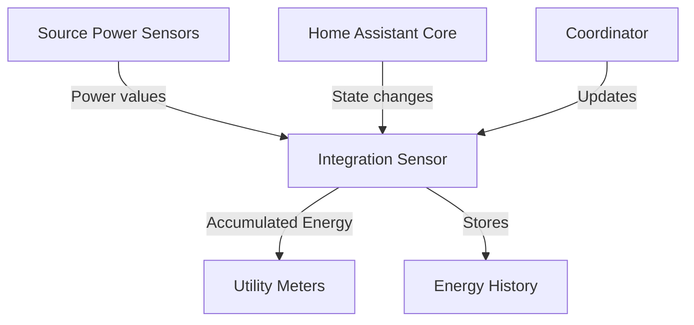

# Refined Implementation Plan for Accumulated Energy Sensors

Based on the extracted data and your feedback, this document outlines a refined plan for implementing the 'Accumulated energy' sensors in your Python-based custom component.

## 1. Architecture Overview



## 2. Implementation Components

### 2.1 Integration Sensor Class

We'll create a new class for integration sensors that will:
- Subscribe to state changes of the source power sensor
- Calculate accumulated energy using the trapezoidal method
- Handle state restoration on Home Assistant restart

### 2.2 Integration Method

Implement only the trapezoidal method for all sensors:
- **Trapezoidal Method**: Calculates the area under the curve using the average of consecutive power readings

### 2.3 Configuration and Registration

Create separate lists of integration sensors in the calculated_sensor.py file for plant and inverter sensors, similar to how other sensor lists are defined (like SCS.INVERTER_SENSORS). These lists will then be used in the existing for loops in sensor.py to add the entities to Home Assistant.

## 3. Detailed Code Structure

### 3.1 Update `calculated_sensor.py` to add integration sensors

```python
"""Calculated sensor implementations for Sigenergy integration."""
# Existing imports...
from datetime import timedelta

from homeassistant.components.sensor import (
    SensorDeviceClass,
    SensorEntityDescription,
    SensorStateClass,
)
from homeassistant.const import (
    UnitOfEnergy,
    UnitOfPower,
)

# Existing code...

class SigenergyIntegrationSensor(SensorEntity, RestoreEntity):
    """Implementation of an Integration Sensor."""

    def __init__(
        self,
        coordinator: SigenergyDataUpdateCoordinator,
        description: SensorEntityDescription,
        name: str,
        device_type: str,
        device_id: Optional[int],
        device_name: Optional[str] = "",
        device_info: Optional[DeviceInfo] = None,
        source_entity_id: str = None,
        round_digits: Optional[int] = None,
        max_sub_interval: Optional[timedelta] = None,
    ) -> None:
        """Initialize the integration sensor."""
        super().__init__(coordinator)
        self.entity_description = description
        self._attr_name = name
        self._device_type = device_type
        self._device_id = device_id
        self._device_info_override = device_info
        self._source_entity_id = source_entity_id
        self._round_digits = round_digits
        self._max_sub_interval = max_sub_interval or timedelta(hours=1)
        
        self._attr_native_value = None
        self._last_updated = None
        self._last_value = None
        
        # Set unique ID
        if device_type == DEVICE_TYPE_PLANT:
            self._attr_unique_id = f"{coordinator.hub.config_entry.entry_id}_{device_type}_{description.key}"
        else:
            device_number_str = device_name.split()[-1]
            device_number_str = f" {device_number_str}" if device_number_str.isdigit() else ""
            self._attr_unique_id = f"{coordinator.hub.config_entry.entry_id}_{device_type}_{device_number_str}_{description.key}"
        
        # Set device info (use provided device_info if available)
        if self._device_info_override:
            self._attr_device_info = self._device_info_override
        else:
            # Use the same device info logic as in SigenergySensor class
            # ...

    # Integration methods and state management implementation
    # ...

class SigenergyCalculatedSensors:
    """Class for holding calculated sensor methods."""

    # Existing sensor lists...
    
    # Add the plant integration sensors list
    PLANT_INTEGRATION_SENSORS = [
        SC.SigenergySensorEntityDescription(
            key="plant_accumulated_pv_energy",
            name="Accumulated PV Energy",
            device_class=SensorDeviceClass.ENERGY,
            native_unit_of_measurement=UnitOfEnergy.KILO_WATT_HOUR,
            state_class=SensorStateClass.TOTAL,
            source_entity_id="sensor.sigen_plant_photovoltaic_power",
            round_digits=3,
            max_sub_interval=timedelta(seconds=30),
        ),
        SC.SigenergySensorEntityDescription(
            key="plant_accumulated_grid_export_energy",
            name="Accumulated Grid Export Energy",
            device_class=SensorDeviceClass.ENERGY,
            native_unit_of_measurement=UnitOfEnergy.KILO_WATT_HOUR,
            state_class=SensorStateClass.TOTAL,
            source_entity_id="sensor.sigen_grid_sensor_export_power",
            round_digits=3,
            max_sub_interval=timedelta(seconds=30),
        ),
        SC.SigenergySensorEntityDescription(
            key="plant_accumulated_grid_import_energy",
            name="Accumulated Grid Import Energy",
            device_class=SensorDeviceClass.ENERGY,
            native_unit_of_measurement=UnitOfEnergy.KILO_WATT_HOUR,
            state_class=SensorStateClass.TOTAL,
            source_entity_id="sensor.sigen_grid_sensor_import_power",
            round_digits=3,
            max_sub_interval=timedelta(seconds=30),
        ),
    ]
    
    # Add the inverter integration sensors list
    INVERTER_INTEGRATION_SENSORS = [
        SC.SigenergySensorEntityDescription(
            key="inverter_accumulated_pv_energy",
            name="Accumulated PV Energy",
            device_class=SensorDeviceClass.ENERGY,
            native_unit_of_measurement=UnitOfEnergy.KILO_WATT_HOUR,
            state_class=SensorStateClass.TOTAL,
            source_entity_id="sensor.sigen_inverter_pv_power",
            round_digits=3,
            max_sub_interval=timedelta(seconds=30),
        ),
    ]
```

### 3.2 Update `sensor.py` to add integration sensors to existing loops

Modify the `async_setup_entry` function in sensor.py to add the integration sensors to the existing loops:

```python
async def async_setup_entry(
    hass: HomeAssistant,
    config_entry: ConfigEntry,
    async_add_entities: AddEntitiesCallback,
) -> None:
    """Set up the Sigenergy sensor platform."""
    coordinator = hass.data[DOMAIN][config_entry.entry_id]["coordinator"]
    entities = []

    # Add plant sensors
    for description in SS.PLANT_SENSORS + SCS.PLANT_SENSORS + SCS.PLANT_INTEGRATION_SENSORS:
        entities.append(
            SigenergySensor(
                coordinator=coordinator,
                description=description,
                name=f"{plant_name} {description.name}",
                device_type=DEVICE_TYPE_PLANT,
                device_id=None,
                device_name=plant_name,
            )
        )
    
    # Add inverter sensors
    inverter_no = 0
    for inverter_id in coordinator.hub.inverter_slave_ids:
        inverter_name = f"Sigen { f'{plant_name.split()[1] } ' if plant_name.split()[1].isdigit() else ''}Inverter{'' if inverter_no == 0 else f' {inverter_no}'}"
        
        # Add inverter sensors including integration sensors
        for description in SS.INVERTER_SENSORS + SCS.INVERTER_SENSORS + SCS.INVERTER_INTEGRATION_SENSORS:
            entities.append(
                SigenergySensor(
                    coordinator=coordinator,
                    description=description,
                    name=f"{inverter_name} {description.name}",
                    device_type=DEVICE_TYPE_INVERTER,
                    device_id=inverter_id,
                    device_name=inverter_name,
                )
            )
            
        # Rest of the existing code for PV string sensors
        # ...
        
        # Increment inverter counter
        inverter_no += 1

    # Rest of the existing code for AC charger sensors, DC charger sensors
    # ...

    async_add_entities(entities)
```

### 3.3 Trapezoidal Method Implementation

```python
def _calculate_trapezoidal(self, previous_value, current_value, time_delta_seconds):
    """Calculate energy using the trapezoidal method."""
    # Average the power values and multiply by time
    return ((previous_value + current_value) / 2) * (time_delta_seconds / 3600)
```

### 3.4 State Management

```python
async def async_added_to_hass(self):
    """Handle entity which will be added."""
    await super().async_added_to_hass()
    
    # Restore previous state if available
    last_state = await self.async_get_last_state()
    if last_state and last_state.state not in (None, "unknown", "unavailable"):
        try:
            self._attr_native_value = float(last_state.state)
            self._last_updated = dt_util.utcnow()
        except (ValueError, TypeError):
            _LOGGER.warning("Could not restore last state for %s", self.entity_id)
    
    # Register to track source sensor state changes
    self.async_on_remove(
        async_track_state_change_event(
            self.hass, [self._source_entity_id], self._async_source_changed
        )
    )
```

## 4. Implementation Details

### 4.1 Handling Max Sub Interval

The `max_sub_interval` parameter limits the maximum time between updates for accurate integration. If the time between updates exceeds this value, we'll need to split the calculation into smaller intervals.

```python
def _handle_max_sub_interval(self, previous_value, current_value, time_delta):
    """Handle max_sub_interval by splitting calculation if needed."""
    if time_delta <= self._max_sub_interval:
        # No need to split
        return self._calculate_trapezoidal(previous_value, current_value, time_delta.total_seconds())
    else:
        # Split into smaller intervals
        energy = 0
        remaining_delta = time_delta
        current_time = self._last_updated
        
        while remaining_delta > self._max_sub_interval:
            interval_end = current_time + self._max_sub_interval
            # For trapezoidal method, we need to interpolate the value at interval_end
            interval_fraction = self._max_sub_interval / time_delta
            interpolated_value = previous_value + (current_value - previous_value) * interval_fraction
            energy += self._calculate_trapezoidal(previous_value, interpolated_value, self._max_sub_interval.total_seconds())
            
            previous_value = interpolated_value
            current_time = interval_end
            remaining_delta -= self._max_sub_interval
        
        # Calculate the final partial interval
        if remaining_delta.total_seconds() > 0:
            energy += self._calculate_trapezoidal(previous_value, current_value, remaining_delta.total_seconds())
        
        return energy
```

### 4.2 Source Sensor State Change Handler

```python
@callback
def _async_source_changed(self, event):
    """Handle source sensor state changes."""
    if (
        (new_state := event.data.get("new_state")) is None
        or new_state.state in ("unknown", "unavailable")
        or (old_state := event.data.get("old_state")) is None
        or old_state.state in ("unknown", "unavailable")
    ):
        return

    try:
        current_value = float(new_state.state)
        previous_value = float(old_state.state)
    except (ValueError, TypeError):
        _LOGGER.warning("Could not parse state for %s", self.entity_id)
        return

    current_time = dt_util.utcnow()
    if self._last_updated:
        time_delta = current_time - self._last_updated
        
        # Calculate energy
        energy = self._handle_max_sub_interval(previous_value, current_value, time_delta)
        
        # Add to accumulated energy
        if self._attr_native_value is None:
            self._attr_native_value = 0
        self._attr_native_value += energy
        
        # Round to specified precision
        if self._round_digits is not None:
            self._attr_native_value = round(self._attr_native_value, self._round_digits)
    
    self._last_updated = current_time
    self.async_write_ha_state()
```

## 5. Configuration for Your Component

Based on the extracted data and your feedback, you'll need to create these integration sensors:

### Plant Integration Sensors:
1. **Plant Accumulated PV Energy**
   - Key: plant_accumulated_pv_energy
   - Source: sensor.sigen_plant_photovoltaic_power
   - Method: trapezoidal
   - Round: 3
   - Max sub interval: 30 seconds

2. **Plant Accumulated Grid Export Energy**
   - Key: plant_accumulated_grid_export_energy
   - Source: sensor.sigen_grid_sensor_export_power
   - Method: trapezoidal
   - Round: 3
   - Max sub interval: 30 seconds

3. **Plant Accumulated Grid Import Energy**
   - Key: plant_accumulated_grid_import_energy
   - Source: sensor.sigen_grid_sensor_import_power
   - Method: trapezoidal
   - Round: 3
   - Max sub interval: 30 seconds

### Inverter Integration Sensors:
1. **Inverter Accumulated PV Energy**
   - Key: inverter_accumulated_pv_energy
   - Source: sensor.sigen_inverter_pv_power
   - Method: trapezoidal
   - Round: 3
   - Max sub interval: 30 seconds

## 6. Considerations and Challenges

1. **State Restoration**: Ensure proper state restoration on Home Assistant restart to maintain accumulated values.

2. **Error Handling**: Implement robust error handling for missing or invalid source sensor values.

3. **Performance**: Consider the performance impact of tracking multiple power sensors, especially with short update intervals.

4. **Testing**: Create tests to verify the accuracy of the integration method.

5. **Documentation**: Document the integration sensor functionality in your component's documentation.
