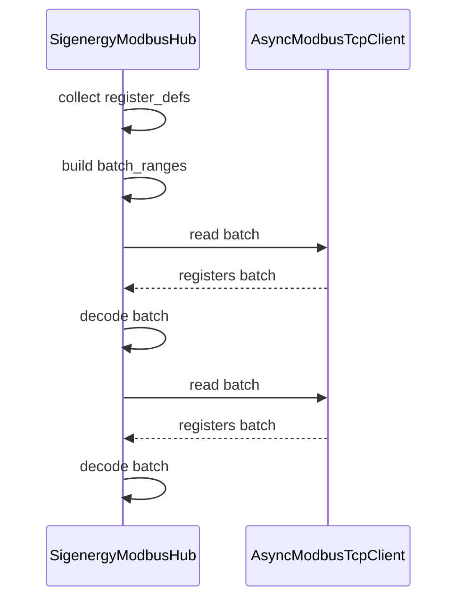

# Modbus Read Optimization Plan

**Objective:** Improve runtime performance by batching and parallelizing Modbus register reads.

## Strategy
1. **Analyze Register Definitions**  
   - Collect `ModbusRegisterDefinition` entries by `update_frequency` and `RegisterType`.  
2. **Build Contiguous Read Ranges**  
   - Sort registers by address.  
   - Merge overlapping or adjacent ranges into minimal batches.  
3. **Execute Batched Reads Under One Lock**  
   - For each batch, perform a single `read_input_registers` or `read_holding_registers` call.  
   - Decode individual register values from the batch result.  
4. **Fallback & Robustness**  
   - On batch read failure, mark batch members `is_supported=False` and continue.  
   - Optionally fall back to per‑register reads if needed.  
5. **Parallelism Across Devices**  
   - Use `asyncio.gather` to read plant, inverter, and charger data concurrently.  
6. **Measurement & Logging**  
   - Add timing instrumentation to verify speed improvements.  
   - Remove per‑register debug logs to reduce noise.  

## Sequence Diagram

**Next Steps:**  
- Implement batching logic in `_async_read_device_data_core`.  
- Validate against `home-assistant.log`.  
- Measure performance improvement and adjust as needed.