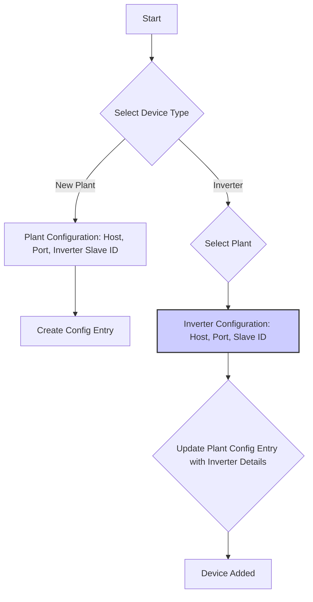

# Sigenergy Multiple Inverter Support Plan

This document outlines the plan to modify the Sigenergy integration to support multiple inverters with individual IP addresses and ports.

## Current Implementation

Currently, the integration supports a single host IP address and port for the entire plant.  All inverters are assumed to be accessible through this single connection.

## Goal

The goal is to allow users to specify a unique host IP address and port for each inverter within a plant. This will enable communication with inverters that are not on the same network segment or require different port configurations.

## Plan

### 1. Modify `config_flow.py`

*   **`async_step_inverter_config`:**
    *   Add `host` and `port` input fields to this step.
    *   When adding the *first* inverter for a plant:
        *   Pre-populate the `host` field with the plant's IP address.
        *   Pre-populate the `port` field with the plant's port.
    *   When adding *subsequent* inverters:
        *   Pre-populate the `port` field with the plant's port, but allow the user to change it.
        *   Leave the `host` field empty, requiring user input.
    *   Store each inverter's `host`, `port`, and `slave_id` in a dictionary within the plant's configuration entry.
        *   The dictionary keys will be the generated inverter names ("Inverter", "Inverter 2", etc.).
        *   The values will be dictionaries containing "host", "port", and "slave_id".  Example:
            ```
            {
              "Inverter": {"host": "192.168.1.10", "port": 502, "slave_id": 1},
              "Inverter 2": {"host": "192.168.1.11", "port": 502, "slave_id": 2},
              "Inverter 3": {"host": "192.168.1.12", "port": 503, "slave_id": 3}
            }
            ```
*   **`_async_load_inverters`:**
    *   Modify this function to load the inverter host and slave ID from the updated configuration structure.

*   **`async_step_select_plant`:**
    *   Keep the existing logic to copy the plant's `host` and `port` to `self._data`. This will be used as the *default* for the first inverter.

### 2. Modify `modbus.py`

*   **`SigenergyModbusHub`:**
    *   Modify the `__init__` method to accept a *dictionary* of inverter connection details (mapping inverter names to host/port/slave\_id) instead of single `host` and `port` values.
    *   Modify the `async_connect` method to take `slave_id` as argument.
        *   Create or select a Modbus client based on host IP and port.
        *   Maintain a dictionary of Modbus clients, keyed by a tuple of (host IP address, port).
    *   Modify the following methods to accept a `slave_id` argument, look up the correct host IP address and port from the inverter connection details, and use the corresponding Modbus client:
        *   `async_read_inverter_data`
        *   `async_read_registers`
        *   `async_write_register`
        *   `async_write_registers`

### 3. Mermaid Diagrams

Configuration flow:



`modbus.py` changes:

```mermaid
graph TD
    A[SigenergyModbusHub Initialization] --> B(Store Inverter Connection Details: {Inverter Name: {host, port, slave_id}});
    B --> C{async_read_inverter_data(slave_id)};
    C --> D{Lookup Host and Port for slave_id};
    D --> E{Get/Create Modbus Client for (Host, Port)};
    E --> F[Perform Modbus Read];
    style B fill:#ccf,stroke:#333,stroke-width:2px;
    style D fill:#ccf,stroke:#333,stroke-width:2px;
    style E fill:#ccf,stroke:#333,stroke-width:2px;

```

### 4. Testing

*   Add a new plant and a single inverter. Verify that the configuration entry stores the plant's IP address and port for the inverter.
*   Add a second inverter to the same plant, providing a *different* IP address and/or port. Verify that the configuration entry stores both sets of connection details, associated with the correct inverter names.
*   Verify that the Modbus communication uses the correct IP address and port for each inverter.