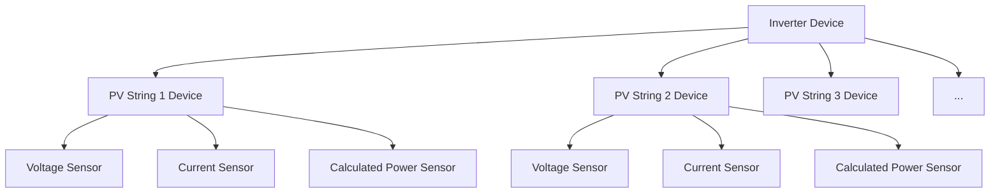

# PV String Sensor Implementation Plan

Based on the requirement to make the PV string data in the UI more manageable, I'm proposing a plan for implementing the 16 PV string voltage/current pairs in a way that creates dedicated devices for active PV strings only.

## Current Status and Challenge

- 16 PV string voltage/current pairs are defined in `const.py` (registers from addresses 31027 to 31065)
- These sensors are not yet implemented in `sensor.py`
- Adding all of these directly as individual sensors would clutter the UI
- Many inverters don't use all 16 strings, so showing all would be redundant

## Proposed Solution: PV String Devices

I propose implementing each PV string as its own device with the following characteristics:



### Key Features:

1. **Presence-Based Discovery**: Create devices for each PV string that returns numeric values (including zeros)
2. **Device Hierarchy**: Each PV string will be a separate device linked to its parent inverter
3. **Calculated Values**: Each PV string device will include:
   - Voltage sensor (from Modbus)
   - Current sensor (from Modbus)
   - Power sensor (calculated as V×A)
4. **Clear Naming**: Devices will be named "PV String X" for easy identification

## Technical Implementation

### 1. Detection Logic with Error Handling

```python
# Determine available PV strings based on data presence (not value)
available_pv_strings = []

_LOGGER.debug("Checking for available PV strings for inverter %s", device_id)

for pv_idx in range(1, 17):  # Check all 16 possible PV strings
    try:
        # Generate keys for voltage and current
        v_key = f"inverter_pv{pv_idx}_voltage"
        c_key = f"inverter_pv{pv_idx}_current"
        
        # Check if both voltage and current exist with numeric values (including zero)
        v_value = inverter_data.get(v_key)
        c_value = inverter_data.get(c_key)
        
        # Debug logging for string detection
        _LOGGER.debug("PV String %d: voltage=%s, current=%s", 
                     pv_idx, v_value, c_value)
        
        # Validation with proper type checking - include all numeric values, even zeros
        if (v_value is not None and c_value is not None and 
            isinstance(v_value, (int, float)) and isinstance(c_value, (int, float))):
            available_pv_strings.append(pv_idx)
            _LOGGER.info("Detected available PV string %d with voltage=%s V, current=%s A", 
                        pv_idx, v_value, c_value)
    except Exception as ex:
        _LOGGER.warning("Error detecting PV string %d: %s", pv_idx, ex)
        continue

_LOGGER.info("Found %d available PV strings for inverter %s", 
            len(available_pv_strings), device_id)
```

### 2. Device Creation with Error Handling

```python
# For each available PV string, create a device
for pv_idx in available_pv_strings:
    try:
        pv_string_name = f"PV String {pv_idx}"
        pv_string_id = f"{coordinator.hub.config_entry.entry_id}_inverter_{device_id}_pv_string_{pv_idx}"
        
        _LOGGER.debug("Creating device for %s with ID %s", pv_string_name, pv_string_id)
        
        # Create device info
        pv_device_info = DeviceInfo(
            identifiers={(DOMAIN, pv_string_id)},
            name=pv_string_name,
            manufacturer="Sigenergy",
            model="PV String",
            via_device=(DOMAIN, f"{coordinator.hub.config_entry.entry_id}_{str(inverter_name).lower().replace(' ', '_')}"),
        )
        
        # Add sensors for this PV string
        entities.extend([
            # Voltage sensor
            SigenergySensor(
                coordinator=coordinator,
                description=SensorEntityDescription(
                    key=f"inverter_pv{pv_idx}_voltage",
                    name="Voltage",
                    device_class=SensorDeviceClass.VOLTAGE,
                    native_unit_of_measurement=UnitOfElectricPotential.VOLT,
                    state_class=SensorStateClass.MEASUREMENT,
                ),
                name=f"{pv_string_name} Voltage",
                device_type=DEVICE_TYPE_INVERTER,
                device_id=device_id,
                device_name=pv_string_name,
                device_info=pv_device_info,
            ),
            # Current sensor
            SigenergySensor(
                coordinator=coordinator,
                description=SensorEntityDescription(
                    key=f"inverter_pv{pv_idx}_current",
                    name="Current",
                    device_class=SensorDeviceClass.CURRENT,
                    native_unit_of_measurement=UnitOfElectricCurrent.AMPERE,
                    state_class=SensorStateClass.MEASUREMENT,
                ),
                name=f"{pv_string_name} Current",
                device_type=DEVICE_TYPE_INVERTER,
                device_id=device_id,
                device_name=pv_string_name,
                device_info=pv_device_info,
            ),
            # Calculated Power sensor with robust calculation
            SigenergySensor(
                coordinator=coordinator,
                description=SigenergySensorEntityDescription(
                    key=f"inverter_pv{pv_idx}_power",
                    name="Power",
                    device_class=SensorDeviceClass.POWER,
                    native_unit_of_measurement=UnitOfPower.WATT,
                    state_class=SensorStateClass.MEASUREMENT,
                    value_fn=calculate_pv_power,  # We'll define this function separately for better error handling
                    extra_fn_data=True,
                ),
                name=f"{pv_string_name} Power",
                device_type=DEVICE_TYPE_INVERTER,
                device_id=device_id,
                device_name=pv_string_name,
                device_info=pv_device_info,
                pv_string_idx=pv_idx,  # Add PV string index for calculated power
            ),
        ])
        _LOGGER.debug("Created sensors for %s", pv_string_name)
    except Exception as ex:
        _LOGGER.error("Error creating device for PV string %d: %s", pv_idx, ex)
        continue
```

### 3. Robust Power Calculation Function

```python
def calculate_pv_power(_, coordinator_data: dict, pv_idx: int = None, device_id: int = None) -> Optional[float]:
    """Calculate PV string power with proper error handling."""
    if not coordinator_data or not pv_idx or not device_id:
        _LOGGER.debug("Missing required data for PV power calculation")
        return None
        
    try:
        inverter_data = coordinator_data.get("inverters", {}).get(device_id, {})
        if not inverter_data:
            _LOGGER.debug("No inverter data available for power calculation")
            return None
            
        v_key = f"inverter_pv{pv_idx}_voltage"
        c_key = f"inverter_pv{pv_idx}_current"
        
        pv_voltage = inverter_data.get(v_key)
        pv_current = inverter_data.get(c_key)
        
        # Validate inputs
        if pv_voltage is None or pv_current is None:
            _LOGGER.debug("Missing voltage or current data for PV string %d", pv_idx)
            return None
            
        if not isinstance(pv_voltage, (int, float)) or not isinstance(pv_current, (int, float)):
            _LOGGER.debug("Invalid data types for PV string %d: voltage=%s, current=%s", 
                        pv_idx, type(pv_voltage), type(pv_current))
            return None
            
        # Calculate power with bounds checking
        # Make sure we don't return unreasonable values
        power = pv_voltage * pv_current  # Already in Watts since voltage is in V and current in A
        
        # Apply some reasonable bounds
        MAX_REASONABLE_POWER = 2000  # 2kW per string is very high already
        if abs(power) > MAX_REASONABLE_POWER:
            _LOGGER.warning("Calculated power for PV string %d seems excessive: %s W", 
                           pv_idx, power)
            
        return power
    except Exception as ex:
        _LOGGER.warning("Error calculating power for PV string %d: %s", pv_idx, ex)
        return None
```

### 4. Update SigenergySensor Class

```python
# Modify the __init__ method to accept new parameters
def __init__(
    self,
    coordinator: SigenergyDataUpdateCoordinator,
    description: SigenergySensorEntityDescription,
    name: str,
    device_type: str,
    device_id: Optional[int],
    device_name: Optional[str] = "",
    device_info: Optional[DeviceInfo] = None,
    pv_string_idx: Optional[int] = None,
) -> None:
    """Initialize the sensor with extended parameters."""
    super().__init__(coordinator)
    self.entity_description = description
    self._attr_name = name
    self._device_type = device_type
    self._device_id = device_id
    self._pv_string_idx = pv_string_idx
    
    # Use provided device_info if available, otherwise create it
    if device_info:
        self._attr_device_info = device_info
    else:
        # Original device info creation logic
        # [...]
        
# Modify the native_value method for PV power calculation
@property
def native_value(self) -> Any:
    """Return the state of the sensor with robust error handling."""
    if self.coordinator.data is None:
        _LOGGER.debug("No coordinator data available for %s", self.entity_id)
        return STATE_UNKNOWN
        
    try:
        # Handle PV power calculation
        if hasattr(self, '_pv_string_idx') and self._pv_string_idx:
            if self.entity_description.key == f"inverter_pv{self._pv_string_idx}_power":
                if hasattr(self.entity_description, "value_fn") and self.entity_description.value_fn:
                    # Use the value_fn function for power calculation
                    return self.entity_description.value_fn(
                        None, 
                        self.coordinator.data, 
                        pv_idx=self._pv_string_idx,
                        device_id=self._device_id
                    )
        
        # Original value retrieval logic
        if self._device_type == DEVICE_TYPE_PLANT:
            value = self.coordinator.data["plant"].get(self.entity_description.key)
        elif self._device_type == DEVICE_TYPE_INVERTER:
            value = self.coordinator.data["inverters"].get(self._device_id, {}).get(
                self.entity_description.key
            )
        # [... rest of the original logic ...]
        
        return value
    except Exception as ex:
        _LOGGER.error("Error getting value for sensor %s: %s", self.entity_id, ex)
        return STATE_UNKNOWN
```

## Persistence Strategy

To handle intermittent data availability issues, we'll implement a persistence strategy to avoid PV strings flashing in and out of existence:

```python
class SigenergyDataUpdateCoordinator(DataUpdateCoordinator):
    """Enhanced coordinator with PV string tracking."""
    
    def __init__(self, *args, **kwargs):
        super().__init__(*args, **kwargs)
        # Track available PV strings with counters
        self.pv_string_status = {}  # {inverter_id: {pv_idx: consecutive_readings}}
        # Thresholds for adding/removing PV strings
        self.AVAILABILITY_CONSECUTIVE_THRESHOLD = 3  # Require 3 consecutive available readings to add
        self.UNAVAILABILITY_CONSECUTIVE_THRESHOLD = 5  # Require 5 consecutive unavailable readings to remove
    
    def track_pv_string_availability(self, inverter_id, pv_data):
        """Track PV string data availability for persistence."""
        if inverter_id not in self.pv_string_status:
            self.pv_string_status[inverter_id] = {}
            
        for pv_idx in range(1, 17):
            v_key = f"inverter_pv{pv_idx}_voltage"
            c_key = f"inverter_pv{pv_idx}_current"
            
            v_value = pv_data.get(v_key)
            c_value = pv_data.get(c_key)
            
            # Check if this string has valid data in the current reading
            # Note: We're checking for presence of numeric data, not the actual value
            has_valid_data = (v_value is not None and c_value is not None and 
                            isinstance(v_value, (int, float)) and isinstance(c_value, (int, float)))
            
            # Initialize if not present
            if pv_idx not in self.pv_string_status[inverter_id]:
                self.pv_string_status[inverter_id][pv_idx] = 0
                
            # Update counter based on current reading
            if has_valid_data:
                # Increment counter for strings with valid data (capped at threshold)
                self.pv_string_status[inverter_id][pv_idx] = min(
                    self.pv_string_status[inverter_id][pv_idx] + 1,
                    self.AVAILABILITY_CONSECUTIVE_THRESHOLD
                )
            else:
                # Decrement counter for strings without valid data (bottomed at negative threshold)
                self.pv_string_status[inverter_id][pv_idx] = max(
                    self.pv_string_status[inverter_id][pv_idx] - 1,
                    -self.UNAVAILABILITY_CONSECUTIVE_THRESHOLD
                )
    
    def get_stable_available_strings(self, inverter_id):
        """Get list of stably available PV strings."""
        if inverter_id not in self.pv_string_status:
            return []
            
        return [
            pv_idx for pv_idx, count in self.pv_string_status[inverter_id].items()
            if count >= self.AVAILABILITY_CONSECUTIVE_THRESHOLD
        ]
```

## Implementation Steps

1. **Modify `sensor.py`**:
   - Add PV string detection logic in `async_setup_entry`
   - Implement the persistence strategy in the coordinator
   - Create a helper function for generating PV string devices and sensors
   - Add robust error handling and logging

2. **Update Initialization**:
   - Modify the `__init__` method of `SigenergySensor` to accept the custom device_info parameter
   - Add the optional pv_string_idx parameter for power calculation
   - Implement the power calculation function with proper error checking

3. **Enhance Logging and Debugging**:
   - Add comprehensive logging at different levels:
     - DEBUG for detailed troubleshooting
     - INFO for normal operations and discoveries
     - WARNING for concerning but non-fatal issues
     - ERROR for failures that need attention
   - Log key events like string detection, value calculation issues

4. **Error Recovery**:
   - Implement graceful handling of partial data
   - Add fallback behaviors when data is missing
   - Ensure sensor availability is properly determined

5. **Testing and Validation**:
   - Test with different numbers of PV strings
   - Verify correct power calculation with error handling
   - Test persistence logic with intermittent values
   - Validate behavior with missing or invalid data
   - Ensure proper device hierarchy in the UI

## Expected User Experience

- Clear hierarchy with PV strings as child devices of inverters
- All PV strings with valid data (including zero values) will be displayed
- Each PV string will have its voltage, current, and calculated power
- Organized structure makes it easy to monitor individual string performance
- Stable operation even with communication issues or partial data

## Benefits and Considerations

### Benefits:
- Cleaner UI with logical grouping
- Easier monitoring of individual string performance
- Automated detection of available strings with stability
- Calculated power values provide additional insights
- Robust error handling prevents cascading failures
- Zero values are properly represented (important for nighttime monitoring)

### Considerations:
- Implementation requires a few refresh cycles to detect stable strings
- Need to balance responsiveness vs. stability in string detection
- Ensure error logs are meaningful for troubleshooting

## Debugging Features

For advanced troubleshooting, consider adding these elements:

1. **Service to Force Refresh PV Strings**:
   ```python
   @service.register_service("refresh_pv_strings")
   async def async_refresh_pv_strings(service_call):
       """Service to force refresh PV string detection."""
       entry_id = service_call.data.get("entry_id")
       if not entry_id or entry_id not in hass.data[DOMAIN]:
           _LOGGER.error("Invalid entry_id provided")
           return
           
       coordinator = hass.data[DOMAIN][entry_id]["coordinator"]
       # Reset PV string status tracking
       coordinator.pv_string_status = {}
       # Force coordinator refresh
       await coordinator.async_refresh()
       _LOGGER.info("PV string detection has been reset and refreshed")
   ```

2. **Diagnostic Attributes**:
   Add diagnostic attributes to each PV string device to help troubleshoot issues:
   - Raw voltage/current values
   - Detection status and history
   - Last update timestamp
   - Error counts

## Conclusion

This implementation provides a structured, robust, and manageable approach to handling the PV string data, with comprehensive error handling and debugging support. It treats all numeric values (including zeros) as valid data points and only omits PV strings that fail to return any values. This makes it easier for users to monitor their solar installation with accurate data representation, while avoiding UI clutter from truly non-existent strings.