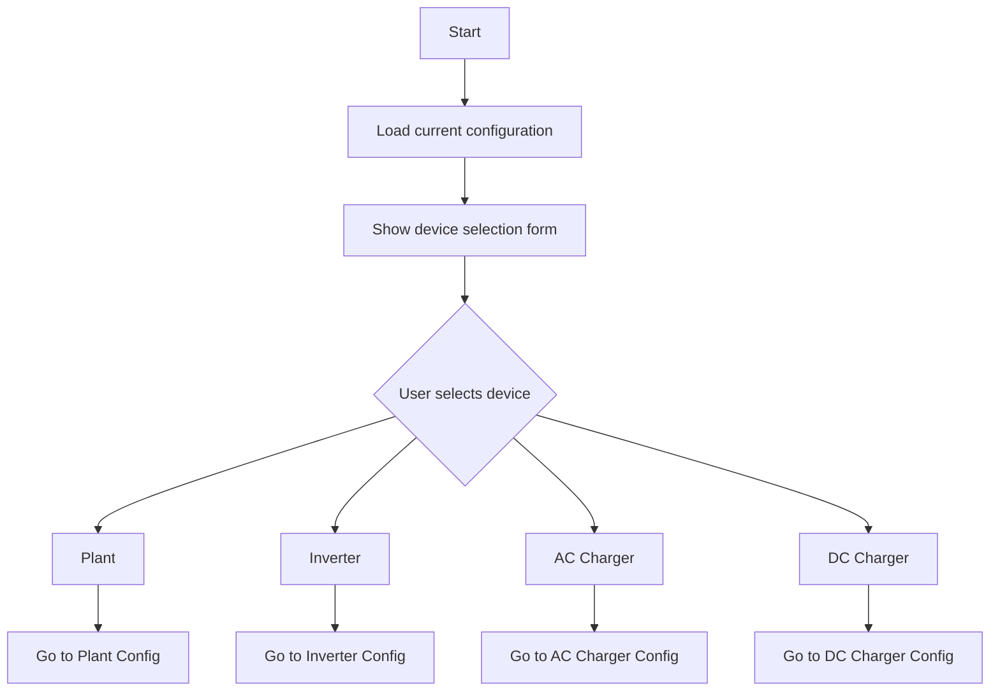
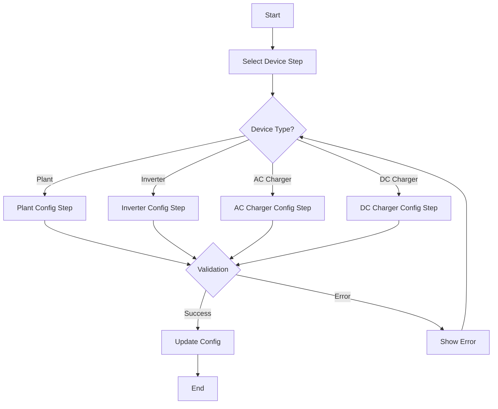

# Refactoring Plan for SigenergyOptionsFlowHandler (Multi-Step Approach)

This document outlines the plan to refactor the `SigenergyOptionsFlowHandler` in `custom_components/sigen/config_flow.py` to implement a multi-step configuration flow. The new approach will provide a clearer, more focused interface for device reconfiguration.

## Overview

The refactored flow will consist of multiple steps:
1. Device Selection
2. Device-Specific Configuration
3. Confirmation and Update

## Detailed Plan:

### 1. Device Selection Step

First, the user selects which device to reconfigure:



Implementation details:
- Create new method `async_step_select_device`
- Build selection schema dynamically based on configured devices
- Show plant name, inverter names, AC charger names, and DC charger names
- Use constants for device types (e.g., `CONF_DEVICE_TYPE`)

### 2. Device-Specific Configuration Steps

Each device type gets its own configuration step:

#### 2.1 Plant Configuration
- Show current plant settings:
  * Host
  * Port
  * Read-only mode
- Validation:
  * Valid host/port combination

#### 2.2 Inverter Configuration
- Show current inverter settings:
  * Host (if not first inverter)
  * Port (if not first inverter)
  * Slave ID
  * Remove device option
- Validation:
  * Slave ID range (1-246)
  * No duplicate IDs
  * Cannot remove if parent to DC charger

#### 2.3 AC Charger Configuration
- Show current AC charger settings:
  * Host
  * Port
  * Slave ID
  * Remove device option
- Validation:
  * Slave ID range (1-246) only

#### 2.4 DC Charger Configuration
- Show current DC charger settings:
  * Parent inverter selection
  * Remove device option
- Validation:
  * Parent inverter must exist

### 3. Implementation Details

1. Create new step methods:
```python
async def async_step_select_device(self, user_input=None)
async def async_step_plant_config(self, user_input=None)
async def async_step_inverter_config(self, user_input=None)
async def async_step_ac_charger_config(self, user_input=None)
async def async_step_dc_charger_config(self, user_input=None)
```

2. Create helper methods:
```python
def _create_device_selection_schema(self)
def _validate_plant_config(self, user_input)
def _validate_inverter_config(self, user_input)
def _validate_ac_charger_config(self, user_input)
def _validate_dc_charger_config(self, user_input)
```

3. Add new constants:
```python
STEP_SELECT_DEVICE = "select_device"
CONF_SELECTED_DEVICE = "selected_device"
CONF_REMOVE_DEVICE = "remove_device"
```

### 4. Flow Control



### 5. Data Management

1. Store selected device info:
```python
self._selected_device = {
    "type": device_type,
    "id": device_id,
    "name": device_name
}
```

2. Maintain configuration state:
```python
self._temp_config = {}  # Store temporary changes
```

3. Update helpers:
```python
def _update_device_config(self)
def _remove_device(self)
```

### 6. Error Handling

Create comprehensive error messages:
```python
ERRORS = {
    "invalid_host": "Invalid host address",
    "invalid_port": "Port must be between 1 and 65535",
    "invalid_slave_id": "Slave ID must be between 1 and 246",
    "duplicate_slave_id": "This Slave ID is already in use",
    "parent_inverter_required": "DC Charger must have a parent inverter",
    "cannot_remove_parent": "Cannot remove inverter while it has DC chargers",
}
```

### 7. User Interface Considerations

1. Clear labeling and help text
2. Confirmation dialogs for device removal
3. Visual indicators for current device being configured
4. Progress indication through the multi-step process

## Migration Strategy

1. Implement new step methods alongside existing code
2. Update entry points to use new flow
3. Maintain backward compatibility where possible

## Future Enhancements

1. Network connectivity validation
2. Batch device updates
3. Configuration templates
4. Import/export configuration