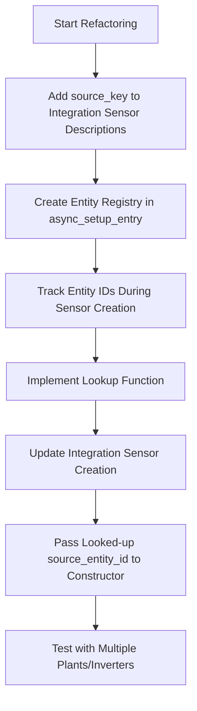

# Refactoring Plan for Sigenergy Integration Sensors

## Overview

This document outlines a plan to refactor the code in `sensor.py` and `calculated_sensor.py` to dynamically assign the correct `source_entity_id` when entities in `PLANT_INTEGRATION_SENSORS` and `INVERTER_INTEGRATION_SENSORS` lists are added to the specific plant or inverter they are associated with during the `async_setup_entry` method.

## Current Issues

1. **Hardcoded Source Entity IDs**: In `calculated_sensor.py`, the `PLANT_INTEGRATION_SENSORS` list has hardcoded values like "sensor.sigen_plant_pv_power" which won't work correctly with multiple plants.

2. **Partial Dynamic Assignment**: For inverter integration sensors, there's an attempt to dynamically set the `source_entity_id` in `sensor.py` (lines 122-123), but it uses a hardcoded pattern that may not match the actual entity naming convention.

3. **No Consideration for Multiple Plants**: The current implementation doesn't properly handle scenarios with multiple plants, as it assumes a single plant naming pattern.

## Proposed Solution



## Detailed Implementation Plan

### Changes to `calculated_sensor.py`

#### 1. Add `source_key` to `SigenergyCalculations.SigenergySensorEntityDescription`

```python
@dataclass
class SigenergySensorEntityDescription(SensorEntityDescription):
    """Class describing Sigenergy sensor entities."""

    entity_registry_enabled_default: bool = True
    value_fn: Optional[Callable[[Any, Optional[Dict[str, Any]], Optional[Dict[str, Any]]], Any]] = None
    extra_fn_data: Optional[bool] = False  # Flag to indicate if value_fn needs coordinator data
    extra_params: Optional[Dict[str, Any]] = None  # Additional parameters for value_fn
    source_entity_id: Optional[str] = None
    source_key: Optional[str] = None  # Add this new attribute
    max_sub_interval: Optional[timedelta] = None
    round_digits: Optional[int] = None
```

#### 2. Update `PLANT_INTEGRATION_SENSORS`

```python
PLANT_INTEGRATION_SENSORS = [
    SigenergyCalculations.SigenergySensorEntityDescription(
        key="plant_accumulated_pv_energy",
        name="Accumulated PV Energy",
        device_class=SensorDeviceClass.ENERGY,
        native_unit_of_measurement=UnitOfEnergy.KILO_WATT_HOUR,
        state_class=SensorStateClass.TOTAL,
        source_key="plant_pv_power",  # Add this
        # Remove or comment out the hardcoded source_entity_id
        # source_entity_id="sensor.sigen_plant_pv_power",
        round_digits=3,
        max_sub_interval=timedelta(seconds=30),
    ),
    SigenergyCalculations.SigenergySensorEntityDescription(
        key="plant_accumulated_grid_export_energy",
        name="Accumulated Grid Export Energy",
        device_class=SensorDeviceClass.ENERGY,
        native_unit_of_measurement=UnitOfEnergy.KILO_WATT_HOUR,
        state_class=SensorStateClass.TOTAL,
        source_key="plant_grid_export_power",  # Add this
        # Remove or comment out the hardcoded source_entity_id
        # source_entity_id="sensor.sigen_plant_grid_export_power",
        round_digits=3,
        max_sub_interval=timedelta(seconds=30),
    ),
    SigenergyCalculations.SigenergySensorEntityDescription(
        key="plant_accumulated_grid_import_energy",
        name="Accumulated Grid Import Energy",
        device_class=SensorDeviceClass.ENERGY,
        native_unit_of_measurement=UnitOfEnergy.KILO_WATT_HOUR,
        state_class=SensorStateClass.TOTAL,
        source_key="plant_grid_import_power",  # Add this
        # Remove or comment out the hardcoded source_entity_id
        # source_entity_id="sensor.sigen_plant_grid_import_power",
        round_digits=3,
        max_sub_interval=timedelta(seconds=30),
    ),
]
```

#### 3. Update `INVERTER_INTEGRATION_SENSORS`

```python
INVERTER_INTEGRATION_SENSORS = [
    SigenergyCalculations.SigenergySensorEntityDescription(
        key="inverter_accumulated_pv_energy",
        name="Accumulated PV Energy",
        device_class=SensorDeviceClass.ENERGY,
        native_unit_of_measurement=UnitOfEnergy.KILO_WATT_HOUR,
        state_class=SensorStateClass.TOTAL,
        source_key="inverter_pv_power",  # Add this
        # Remove or comment out the hardcoded source_entity_id
        # source_entity_id="sensor.sigen_inverter_pv_power",
        round_digits=3,
        max_sub_interval=timedelta(seconds=30),
    ),
]
```

### Changes to `sensor.py`

#### 1. Create Entity Registry and Lookup Function

Add the following code at the beginning of `async_setup_entry`:

```python
async def async_setup_entry(
    hass: HomeAssistant,
    config_entry: ConfigEntry,
    async_add_entities: AddEntitiesCallback,
) -> None:
    """Set up the Sigenergy sensor platform."""
    coordinator = hass.data[DOMAIN][config_entry.entry_id]["coordinator"]
    entities = []
    
    # Create an entity registry to track created entity IDs
    entity_registry = {}  # Format: {(device_type, device_id): {key: entity_id}}
    
    # Helper function to get source entity ID
    def get_source_entity_id(device_type, device_id, source_key):
        """Get the source entity ID for an integration sensor."""
        device_key = (device_type, device_id)
        if device_key in entity_registry and source_key in entity_registry[device_key]:
            return entity_registry[device_key][source_key]
        _LOGGER.warning(
            "Could not find source entity with key %s for device type %s, device ID %s",
            source_key, device_type, device_id
        )
        return None
    
    # ... rest of the function
```

#### 2. Track Entity IDs During Plant Sensor Creation

Modify the plant sensor creation code:

```python
# Add plant sensors
for description in SS.PLANT_SENSORS + SCS.PLANT_SENSORS:
    sensor_name = f"{plant_name} {description.name}"
    entity_id = f"sensor.{sensor_name.lower().replace(' ', '_')}"
    _LOGGER.debug("Creating plant sensor with name: %s, expected entity_id: %s, key: %s",
                 sensor_name, entity_id, description.key)
    
    # Track the entity ID
    device_key = (DEVICE_TYPE_PLANT, None)  # Plant has no device_id
    if device_key not in entity_registry:
        entity_registry[device_key] = {}
    entity_registry[device_key][description.key] = entity_id
    
    entities.append(
        SigenergySensor(
            coordinator=coordinator,
            description=description,
            name=sensor_name,
            device_type=DEVICE_TYPE_PLANT,
            device_id=None,
            device_name=plant_name,
        )
    )
```

#### 3. Update Plant Integration Sensor Creation

Modify the plant integration sensor creation code:

```python
# Add plant integration sensors
for description in SCS.PLANT_INTEGRATION_SENSORS:
    # Look up the source entity ID based on the source key
    source_entity_id = get_source_entity_id(
        DEVICE_TYPE_PLANT,
        None,  # Plant has no device_id
        description.source_key
    )
    
    if source_entity_id:
        _LOGGER.debug("Creating plant integration sensor with source entity ID: %s", source_entity_id)
        entities.append(
            SigenergyIntegrationSensor(
                coordinator=coordinator,
                description=description,
                name=f"{plant_name} {description.name}",
                device_type=DEVICE_TYPE_PLANT,
                device_id=None,
                device_name=plant_name,
                source_entity_id=source_entity_id,
                round_digits=description.round_digits,
                max_sub_interval=description.max_sub_interval,
            )
        )
    else:
        _LOGGER.warning(
            "Skipping integration sensor %s because source entity not found",
            f"{plant_name} {description.name}"
        )
```

#### 4. Track Entity IDs During Inverter Sensor Creation

Modify the inverter sensor creation code:

```python
# Add inverter sensors
for description in SS.INVERTER_SENSORS + SCS.INVERTER_SENSORS:
    sensor_name = f"{inverter_name} {description.name}"
    entity_id = f"sensor.{sensor_name.lower().replace(' ', '_')}"
    
    # Track the entity ID
    device_key = (DEVICE_TYPE_INVERTER, inverter_id)
    if device_key not in entity_registry:
        entity_registry[device_key] = {}
    entity_registry[device_key][description.key] = entity_id
    
    entities.append(
        SigenergySensor(
            coordinator=coordinator,
            description=description,
            name=sensor_name,
            device_type=DEVICE_TYPE_INVERTER,
            device_id=inverter_id,
            device_name=inverter_name,
        )
    )
```

#### 5. Update Inverter Integration Sensor Creation

Replace the hardcoded source entity ID with the dynamic lookup:

```python
# Add inverter integration sensors
for description in SCS.INVERTER_INTEGRATION_SENSORS:
    # Look up the source entity ID based on the source key
    source_entity_id = get_source_entity_id(
        DEVICE_TYPE_INVERTER,
        inverter_id,
        description.source_key
    )
    
    if source_entity_id:
        _LOGGER.debug("Creating inverter integration sensor with source entity ID: %s", source_entity_id)
        entities.append(
            SigenergyIntegrationSensor(
                coordinator=coordinator,
                description=description,
                name=f"{inverter_name} {description.name}",
                device_type=DEVICE_TYPE_INVERTER,
                device_id=inverter_id,
                device_name=inverter_name,
                source_entity_id=source_entity_id,
                round_digits=description.round_digits,
                max_sub_interval=description.max_sub_interval,
            )
        )
    else:
        _LOGGER.warning(
            "Skipping integration sensor %s because source entity not found",
            f"{inverter_name} {description.name}"
        )
```

#### 6. Track Entity IDs for PV String Sensors

Add entity tracking for PV string sensors:

```python
# Inside the PV string sensor creation loop
for description in SS.PV_STRING_SENSORS + SCS.PV_STRING_SENSORS:
    sensor_name = f"{pv_string_name} {description.name}"
    entity_id = f"sensor.{sensor_name.lower().replace(' ', '_')}"
    
    # Track the entity ID - use a special key format for PV strings
    device_key = (DEVICE_TYPE_INVERTER, inverter_id, pv_idx)
    if device_key not in entity_registry:
        entity_registry[device_key] = {}
    entity_registry[device_key][description.key] = entity_id
    
    # ... rest of the PV string sensor creation code
```

## Testing Considerations

After implementing these changes, we should test the integration with:

1. A single plant with a single inverter
2. A single plant with multiple inverters
3. Multiple plants with multiple inverters

This will ensure that the dynamic source entity ID assignment works correctly in all scenarios.

## Benefits of the Refactoring Approach

This refactoring approach offers several significant benefits that will improve the code's reliability, maintainability, and flexibility:

### 1. Elimination of Hardcoded Entity IDs

The current implementation uses hardcoded entity IDs (like "sensor.sigen_plant_pv_power") which creates several problems:
- It assumes a specific naming convention that might change
- It doesn't account for multiple plants with different names
- It creates tight coupling between the sensor definitions and their implementation

By removing these hardcoded values, we make the code more adaptable to changes in naming conventions and entity structures.

### 2. Dynamic Source Entity Assignment

The new approach dynamically assigns the correct source entity ID based on:
- The specific plant or inverter the integration sensor is associated with
- The actual entity IDs that were created during setup
- A logical relationship defined by the `source_key`

This ensures that integration sensors always reference the correct source entity, even when there are multiple plants or inverters with different naming patterns.

### 3. Better Support for Multiple Plants and Inverters

The refactored code properly handles scenarios with multiple plants and inverters by:
- Tracking entity IDs by device type and device ID
- Looking up the correct source entity based on the specific device instance
- Maintaining proper entity relationships regardless of how many devices are present

This makes the integration more robust in complex installations with multiple Sigenergy devices.

### 4. Improved Maintainability

The key-based lookup system makes the code more maintainable in several ways:
- Changes to entity naming conventions only need to be updated in one place
- The relationship between integration sensors and their sources is clearly defined
- The code is more self-documenting, with explicit relationships between entities

This reduces the likelihood of errors when making future changes to the codebase.

### 5. Enhanced Error Handling

The new implementation includes better error handling:
- Appropriate logging when source entities cannot be found
- Skipping integration sensors when their source entities are missing
- Clear diagnostic information to help troubleshoot issues

This makes the integration more robust and easier to debug.

### 6. Clearer Relationship Definition

The use of `source_key` makes the relationship between integration sensors and their source entities more explicit:
- It's clear which source entity each integration sensor depends on
- The relationship is defined at the sensor definition level
- The implementation details are separated from the relationship definition

This separation of concerns makes the code easier to understand and maintain.