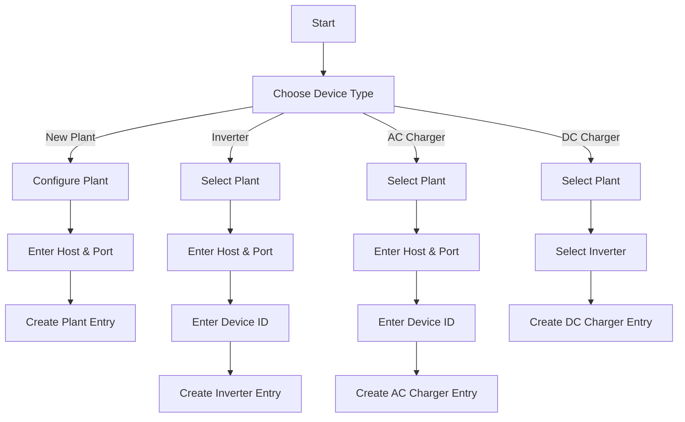

# Refactoring Plan for Sigenergy Config Flow

## Requirements

- Remove the need to specify plant_id. It should always be 247 (DEFAULT_PLANT_SLAVE_ID).
- The current configuration schema should only be used if this is the first integration of this type being added or "New Plant" is chosen.
- Otherwise, a schema where the user is asked to choose the type of device they want to add should be used.
- Different schemas should be used for each device type.
- For "New Plant", only host and port should be collected.
- Inverters and AC/DC Chargers can only be added to an existing Plant configuration.
- DC Chargers are physically connected to inverters and share the same Device ID (Slave ID).
- All device types except DC Chargers should also ask for IP address (Host).

## Current Status

After reviewing the code, most of the required changes are already implemented:

1. The config_flow.py file has:
   - Device type selection (New Plant, Inverter, AC Charger, DC Charger)
   - Plant configuration without plant_id (it's set to DEFAULT_PLANT_SLAVE_ID)
   - Plant selection for devices
   - Inverter selection for DC Chargers
   - Device-specific configuration steps

2. The strings.json and translations/en.json files have the necessary translations for all the steps.

The current configuration flow:
- Collects host, port, plant_id, inverter_slave_ids, ac_charger_slave_ids, and dc_charger_slave_ids in a single step
- Always uses plant_id 247 (DEFAULT_PLANT_SLAVE_ID) but requires it to be specified
- Doesn't distinguish between different device types during initial setup

## Changes Needed

1. Remove the STEP_USER_DATA_SCHEMA from config_flow.py as it's no longer needed. The user step should now either:
   - Show device type selection if plants exist
   - Go directly to plant configuration if no plants exist

2. Ensure the plant_id is always set to DEFAULT_PLANT_SLAVE_ID in the plant configuration step (this is already done)

3. Update the strings.json and translations/en.json files to remove any references to plant_id (if any)

## Refactoring Goals

1. Remove the need to specify plant_id (always use 247, DEFAULT_PLANT_SLAVE_ID)
2. Create a multi-step configuration flow:
   - First step: Choose device type ("New Plant", "Inverter", "AC Charger", "DC Charger")
   - Subsequent steps depend on the chosen device type

## Detailed Flow Structure



## Implementation Details

### 1. Constants and Step Definitions

We need to add new constants for the device types and configuration steps:

```python
# Device type options
DEVICE_TYPE_NEW_PLANT = "new_plant"
DEVICE_TYPE_INVERTER = "inverter"
DEVICE_TYPE_AC_CHARGER = "ac_charger"
DEVICE_TYPE_DC_CHARGER = "dc_charger"

# Configuration step identifiers
STEP_USER = "user"  # Already exists
STEP_DEVICE_TYPE = "device_type"
STEP_PLANT_CONFIG = "plant_config"
STEP_INVERTER_CONFIG = "inverter_config"
STEP_AC_CHARGER_CONFIG = "ac_charger_config"
STEP_DC_CHARGER_CONFIG = "dc_charger_config"
STEP_SELECT_PLANT = "select_plant"
STEP_SELECT_INVERTER = "select_inverter"
```

### 2. Schema Definitions

We need to define schemas for each step:

```python
# Device type selection schema
STEP_DEVICE_TYPE_SCHEMA = vol.Schema(
    {
        vol.Required("device_type"): vol.In(
            {
                DEVICE_TYPE_NEW_PLANT: "New Plant",
                DEVICE_TYPE_INVERTER: "Inverter",
                DEVICE_TYPE_AC_CHARGER: "AC Charger",
                DEVICE_TYPE_DC_CHARGER: "DC Charger",
            }
        ),
    }
)

# Plant configuration schema (simplified - only host and port)
STEP_PLANT_CONFIG_SCHEMA = vol.Schema(
    {
        vol.Required(CONF_HOST): str,
        vol.Required(CONF_PORT, default=DEFAULT_PORT): int,
    }
)

# Inverter configuration schema
STEP_INVERTER_CONFIG_SCHEMA = vol.Schema(
    {
        vol.Required(CONF_HOST): str,
        vol.Required(CONF_PORT, default=DEFAULT_PORT): int,
        vol.Required(CONF_SLAVE_ID, default=DEFAULT_INVERTER_SLAVE_ID): int,
    }
)

# AC Charger configuration schema
STEP_AC_CHARGER_CONFIG_SCHEMA = vol.Schema(
    {
        vol.Required(CONF_HOST): str,
        vol.Required(CONF_PORT, default=DEFAULT_PORT): int,
        vol.Required(CONF_SLAVE_ID): int,
    }
)

# DC Charger configuration schema (no host/port as it uses the inverter's connection)
STEP_DC_CHARGER_CONFIG_SCHEMA = vol.Schema(
    {
        # No fields needed as it shares the inverter's slave ID
    }
)
```

### 3. Config Flow Class Modifications

The `SigenergyConfigFlow` class needs to be updated to handle the multi-step flow:

```python
class SigenergyConfigFlow(config_entries.ConfigFlow, domain=DOMAIN):
    """Handle a config flow for Sigenergy ESS."""

    VERSION = 1

    def __init__(self) -> None:
        """Initialize the config flow."""
        self._data = {}
        self._plants = {}
        self._inverters = {}

    async def async_step_user(self, user_input: dict[str, Any] | None = None) -> FlowResult:
        """Handle the initial step - device type selection."""
        # Load existing plants and inverters
        await self._async_load_plants()
        
        # If no plants exist, go directly to plant configuration
        if not self._plants and user_input is None:
            return await self.async_step_plant_config()
            
        # Otherwise, show device type selection
        return await self.async_step_device_type(user_input)
        
    async def async_step_device_type(self, user_input: dict[str, Any] | None = None) -> FlowResult:
        """Handle device type selection."""
        if user_input is None:
            return self.async_show_form(
                step_id=STEP_DEVICE_TYPE,
                data_schema=STEP_DEVICE_TYPE_SCHEMA,
            )
            
        device_type = user_input["device_type"]
        self._data[CONF_DEVICE_TYPE] = device_type
        
        if device_type == DEVICE_TYPE_NEW_PLANT:
            return await self.async_step_plant_config()
        elif device_type == DEVICE_TYPE_INVERTER:
            return await self.async_step_select_plant()
        elif device_type == DEVICE_TYPE_AC_CHARGER:
            return await self.async_step_select_plant()
        elif device_type == DEVICE_TYPE_DC_CHARGER:
            return await self.async_step_select_plant()
            
        # Should never reach here
        return self.async_abort(reason="unknown_device_type")
```

### 4. Plant Configuration Step

```python
async def async_step_plant_config(self, user_input: dict[str, Any] | None = None) -> FlowResult:
    """Handle plant configuration."""
    errors = {}
    
    if user_input is None:
        return self.async_show_form(
            step_id=STEP_PLANT_CONFIG,
            data_schema=STEP_PLANT_CONFIG_SCHEMA,
        )
    
    # Store plant configuration
    self._data.update(user_input)
    
    # Set the plant ID to the default value
    self._data[CONF_PLANT_ID] = DEFAULT_PLANT_SLAVE_ID
    
    # Initialize empty lists for device IDs
    self._data[CONF_INVERTER_SLAVE_ID] = []
    self._data[CONF_AC_CHARGER_SLAVE_ID] = []
    self._data[CONF_DC_CHARGER_SLAVE_ID] = []
    
    # Set the device type as plant
    self._data[CONF_DEVICE_TYPE] = DEVICE_TYPE_PLANT
    
    # Generate a name based on the number of existing plants
    plant_no = len(self._plants)
    self._data[CONF_NAME] = f"Sigen{' ' if plant_no == 0 else f' {plant_no} '}Plant"
    
    # Create the configuration entry
    return self.async_create_entry(title=self._data[CONF_NAME], data=self._data)
```

### 5. Plant Selection Step

```python
async def async_step_select_plant(self, user_input: dict[str, Any] | None = None) -> FlowResult:
    """Handle plant selection."""
    if not self._plants:
        # No plants available, show error
        return self.async_abort(reason="no_plants_available")
    
    if user_input is None:
        # Create schema with plant selection
        schema = vol.Schema({
            vol.Required("plant_id"): vol.In(self._plants),
        })
        
        return self.async_show_form(
            step_id=STEP_SELECT_PLANT,
            data_schema=schema,
        )
    
    # Store selected plant ID
    self._data["parent_plant_id"] = user_input["plant_id"]
    
    # Proceed based on device type
    device_type = self._data[CONF_DEVICE_TYPE]
    if device_type == DEVICE_TYPE_INVERTER:
        return await self.async_step_inverter_config()
    elif device_type == DEVICE_TYPE_AC_CHARGER:
        return await self.async_step_ac_charger_config()
    elif device_type == DEVICE_TYPE_DC_CHARGER:
        return await self.async_step_select_inverter()
    
    # Should never reach here
    return self.async_abort(reason="unknown_device_type")
```

### 6. Inverter Configuration Step

```python
async def async_step_inverter_config(self, user_input: dict[str, Any] | None = None) -> FlowResult:
    """Handle inverter configuration."""
    errors = {}
    
    if user_input is None:
        return self.async_show_form(
            step_id=STEP_INVERTER_CONFIG,
            data_schema=STEP_INVERTER_CONFIG_SCHEMA,
        )
    
    # Validate slave ID
    slave_id = user_input[CONF_SLAVE_ID]
    if not (1 <= slave_id <= 246):
        errors[CONF_SLAVE_ID] = "each_id_must_be_between_1_and_246"
        return self.async_show_form(
            step_id=STEP_INVERTER_CONFIG,
            data_schema=STEP_INVERTER_CONFIG_SCHEMA,
            errors=errors,
        )
    
    # Store inverter configuration
    self._data.update(user_input)
    
    # Set the device type as inverter
    self._data[CONF_DEVICE_TYPE] = DEVICE_TYPE_INVERTER
    
    # Store the inverter slave ID as a list with a single item
    self._data[CONF_INVERTER_SLAVE_ID] = [slave_id]
    
    # Generate a name for the inverter
    plant_name = self._plants[self._data["parent_plant_id"]]
    self._data[CONF_NAME] = f"{plant_name} Inverter {slave_id}"
    
    # Create the configuration entry
    return self.async_create_entry(title=self._data[CONF_NAME], data=self._data)
```

### 7. AC Charger Configuration Step

```python
async def async_step_ac_charger_config(self, user_input: dict[str, Any] | None = None) -> FlowResult:
    """Handle AC charger configuration."""
    errors = {}
    
    if user_input is None:
        return self.async_show_form(
            step_id=STEP_AC_CHARGER_CONFIG,
            data_schema=STEP_AC_CHARGER_CONFIG_SCHEMA,
        )
    
    # Validate slave ID
    slave_id = user_input[CONF_SLAVE_ID]
    if not (1 <= slave_id <= 246):
        errors[CONF_SLAVE_ID] = "each_id_must_be_between_1_and_246"
        return self.async_show_form(
            step_id=STEP_AC_CHARGER_CONFIG,
            data_schema=STEP_AC_CHARGER_CONFIG_SCHEMA,
            errors=errors,
        )
    
    # Store AC charger configuration
    self._data.update(user_input)
    
    # Set the device type as AC charger
    self._data[CONF_DEVICE_TYPE] = DEVICE_TYPE_AC_CHARGER
    
    # Store the AC charger slave ID as a list with a single item
    self._data[CONF_AC_CHARGER_SLAVE_ID] = [slave_id]
    
    # Generate a name for the AC charger
    plant_name = self._plants[self._data["parent_plant_id"]]
    self._data[CONF_NAME] = f"{plant_name} AC Charger {slave_id}"
    
    # Create the configuration entry
    return self.async_create_entry(title=self._data[CONF_NAME], data=self._data)
```

### 8. Inverter Selection Step (for DC Charger)

```python
async def async_step_select_inverter(self, user_input: dict[str, Any] | None = None) -> FlowResult:
    """Handle inverter selection for DC charger."""
    # Load inverters for the selected plant
    await self._async_load_inverters(self._data["parent_plant_id"])
    
    if not self._inverters:
        # No inverters available for this plant, show error
        return self.async_abort(reason="no_inverters_available")
    
    if user_input is None:
        # Create schema with inverter selection
        schema = vol.Schema({
            vol.Required("inverter_id"): vol.In(self._inverters),
        })
        
        return self.async_show_form(
            step_id=STEP_SELECT_INVERTER,
            data_schema=schema,
        )
    
    # Store selected inverter ID
    inverter_id = user_input["inverter_id"]
    self._data["parent_inverter_id"] = inverter_id
    
    # Get the inverter's slave ID
    inverter_entry = self.hass.config_entries.async_get_entry(inverter_id)
    slave_id = inverter_entry.data[CONF_INVERTER_SLAVE_ID][0]
    
    # Set the device type as DC charger
    self._data[CONF_DEVICE_TYPE] = DEVICE_TYPE_DC_CHARGER
    
    # Store the DC charger slave ID (same as the inverter's)
    self._data[CONF_DC_CHARGER_SLAVE_ID] = [slave_id]
    
    # Copy host and port from the inverter
    self._data[CONF_HOST] = inverter_entry.data[CONF_HOST]
    self._data[CONF_PORT] = inverter_entry.data[CONF_PORT]
    
    # Generate a name for the DC charger
    inverter_name = self._inverters[inverter_id]
    self._data[CONF_NAME] = f"{inverter_name} DC Charger"
    
    # Create the configuration entry
    return self.async_create_entry(title=self._data[CONF_NAME], data=self._data)
```

### 9. Helper Methods

```python
async def _async_load_plants(self) -> None:
    """Load existing plants from config entries."""
    self._plants = {}
    
    for entry in self.hass.config_entries.async_entries(DOMAIN):
        if entry.data.get(CONF_DEVICE_TYPE) == DEVICE_TYPE_PLANT:
            self._plants[entry.entry_id] = entry.data.get(CONF_NAME, f"Plant {entry.entry_id}")

async def _async_load_inverters(self, plant_id: str) -> None:
    """Load existing inverters for a specific plant."""
    self._inverters = {}
    
    for entry in self.hass.config_entries.async_entries(DOMAIN):
        if (entry.data.get(CONF_DEVICE_TYPE) == DEVICE_TYPE_INVERTER and
                entry.data.get("parent_plant_id") == plant_id):
            self._inverters[entry.entry_id] = entry.data.get(CONF_NAME, f"Inverter {entry.entry_id}")
```

### 10. Update Strings.json and Translations

The strings.json and translations/en.json files need to be updated to include the new steps and options:

```json
{
  "config": {
    "step": {
      "device_type": {
        "title": "Select Device Type",
        "description": "Choose the type of Sigenergy device you want to add.",
        "data": {
          "device_type": "Device Type"
        }
      },
      "plant_config": {
        "title": "Configure Sigenergy Plant",
        "description": "Set up a new Sigenergy Energy Storage System plant.",
        "data": {
          "host": "Host (IP address of the main Sigenergy inverter)",
          "port": "Port (default is 502)"
        }
      },
      "select_plant": {
        "title": "Select Plant",
        "description": "Choose which Sigenergy plant this device belongs to.",
        "data": {
          "plant_id": "Plant"
        }
      },
      "inverter_config": {
        "title": "Configure Sigenergy Inverter",
        "description": "Set up a Sigenergy inverter connected to the selected plant.",
        "data": {
          "host": "Host (IP address of the inverter)",
          "port": "Port (default is 502)",
          "slave_id": "Device ID (between 1 and 246)"
        }
      },
      "ac_charger_config": {
        "title": "Configure Sigenergy AC Charger",
        "description": "Set up a Sigenergy AC charger connected to the selected plant.",
        "data": {
          "host": "Host (IP address of the AC charger)",
          "port": "Port (default is 502)",
          "slave_id": "Device ID (between 1 and 246)"
        }
      },
      "select_inverter": {
        "title": "Select Inverter",
        "description": "Choose which inverter this DC charger is connected to.",
        "data": {
          "inverter_id": "Inverter"
        }
      }
    },
    "error": {
      "cannot_connect": "Failed to connect to the Sigenergy system. Please check the host and port.",
      "unknown": "An unexpected error occurred.",
      "invalid_integer_value": "Invalid integer value.",
      "each_id_must_be_between_1_and_246": "Device ID must be between 1 and 246.",
      "duplicate_ids_found": "Duplicate IDs found.",
      "dc_charger_requires_inverter": "DC charger IDs must correspond to configured inverter IDs.",
      "ac_charger_conflicts_inverter": "AC charger IDs must be different from inverter IDs."
    },
    "abort": {
      "already_configured": "This Sigenergy device is already configured.",
      "no_plants_available": "No Sigenergy plants available. Please add a plant first.",
      "no_inverters_available": "No inverters available for this plant. Please add an inverter first."
    }
  }
}
```

## Implementation Steps

1. Remove the STEP_USER_DATA_SCHEMA from config_flow.py
2. Verify that the async_step_user method correctly handles the flow based on whether plants exist
3. Ensure the plant_id is always set to DEFAULT_PLANT_SLAVE_ID in the plant configuration step
4. Update the strings.json and translations/en.json files to remove any references to plant_id (if any)
5. Update the const.py file with the new constants
6. Modify the config_flow.py file to implement the multi-step flow
7. Test each flow path to ensure it works correctly

## Potential Challenges and Solutions

1. **Challenge**: Ensuring backward compatibility with existing configurations.
   **Solution**: The refactored code should still be able to handle existing configurations during updates and options flows.

2. **Challenge**: Handling the relationship between plants, inverters, and chargers.
   **Solution**: Store parent-child relationships in the configuration data to maintain the hierarchy.

3. **Challenge**: Validating that DC chargers are properly associated with inverters.
   **Solution**: Implement validation in the DC charger configuration step to ensure the selected inverter exists.

## Conclusion

This refactoring plan provides a comprehensive approach to updating the Sigenergy integration's configuration flow to meet the requirements. The multi-step flow will guide users through the process of adding different types of devices, ensuring that all necessary information is collected while maintaining the relationships between devices.

Most of the required changes are already implemented in the codebase, but we need to make a few adjustments to fully meet the requirements:
1. Remove the STEP_USER_DATA_SCHEMA and update the async_step_user method
2. Ensure plant_id is always set to DEFAULT_PLANT_SLAVE_ID
3. Update any references to plant_id in the translation files